# FS_System - README

项目源码地址：[https://github.com/xyqcjsy/FS_System](https://github.com/xyqcjsy/FS_System)

项目访问IP：[120.26.255.180](http://120.26.255.180/dashboard)

      
      
      

> © CSU BS IMS 谢扬强

## 目录

[一、项目愿景](#一项目愿景)

[二、业务建模](#二业务建模)

* [2.1 系统概述](#21-系统概述)
* [2.2 业务角色](#22-业务角色)
* [2.3 核心业务流程](#23-核心业务流程)
    * [2.3.1 销售与收入确认流程](#231-销售与收入确认流程)
    * [2.3.2 采购与应付流程](#232-采购与应付流程)
    * [2.3.3 费用报销流程](#233-费用报销流程)
    * [2.3.4 期末结转与报表生成](#234-期末结转与报表生成)
* [2.4 关键业务规则](#24-关键业务规则)
* [2.5 总体业务用例图](#25-总体业务用例图)

[三、用例规约](#三用例规约)

* [3.1 系统基础设置模块](#31-系统基础设置模块)
    * [UC-SYS-01: 企业主体信息维护](#uc-sys-01-企业主体信息维护)
    * [UC-SYS-02: 员工档案管理](#uc-sys-02-员工档案管理)
    * [UC-SYS-03: 客户/供应商档案管理](#uc-sys-03-客户供应商档案管理)
    * [UC-SYS-04: 会计科目体系配置](#uc-sys-04-会计科目体系配置)
* [3.2 业务管理模块](#32-业务管理模块)
    * [UC-BUS-01: 销售发票全流程](#uc-bus-01-销售发票全流程)
    * [UC-BUS-02: 采购订单全流程](#uc-bus-02-采购订单全流程)
    * [UC-BUS-03: 费用报销审批流](#uc-bus-03-费用报销审批流)
* [3.3 总账会计核算模块](#33-总账会计核算模块)
    * [UC-ACC-01: 业务智能过账](#uc-acc-01-业务智能过账)
    * [UC-ACC-02: 凭证全生命周期管理](#uc-acc-02-凭证全生命周期管理)
    * [UC-ACC-03: 银行/现金自动对账](#uc-acc-03-银行现金自动对账)
    * [UC-ACC-04: 定期业务处理](#uc-acc-04-定期业务处理)
    * [UC-ACC-05: 税务管理](#uc-acc-05-税务管理)
* [3.4 财务报表模块](#34-财务报表模块)
    * [UC-RPT-01: 资产负债表生成与导出](#uc-rpt-01-资产负债表生成与导出)
    * [UC-RPT-02: 利润表生成与导出](#uc-rpt-02-利润表生成与导出)
    * [UC-RPT-03: 现金流量表生成与导出](#uc-rpt-03-现金流量表生成与导出)

[四、分析类图](#四分析类图)

* [4.1 分析概览](#41-分析概览)
* [4.2 系统分析类图](#42-系统分析类图)
* [4.3 核心类详解](#43-核心类详解)
    * [4.3.1 会计科目类 (AccountSubject)](#431-会计科目类-accountsubject)
    * [4.3.2 凭证与分录类 (Voucher & VoucherEntry)](#432-凭证与分录类-voucher--voucherentry)
    * [4.3.3 业务单据类 (Sales/Purchase/Expense)](#433-业务单据类-salespurchaseexpense)
    * [4.3.4 过账与对账类](#434-过账与对账类)
* [4.4 类间关系分析](#44-类间关系分析)

[五、分析序列图](#五分析序列图)

* [5.1 系统管理模块](#51-系统管理模块)
    * [5.1.1 企业主体信息维护 (UC-SYS-01)](#511-企业主体信息维护-uc-sys-01)
    * [5.1.2 员工档案管理 (UC-SYS-02)](#512-员工档案管理-uc-sys-02)
    * [5.1.3 客户/供应商档案管理 (UC-SYS-03)](#513-客户供应商档案管理-uc-sys-03)
    * [5.1.4 会计科目体系配置 (UC-SYS-04)](#514-会计科目体系配置-uc-sys-04)
* [5.2 业务管理模块](#52-业务管理模块)
    * [5.2.1 销售发票全流程 (UC-BUS-01)](#521-销售发票全流程-uc-bus-01)
    * [5.2.2 采购订单全流程 (UC-BUS-02)](#522-采购订单全流程-uc-bus-02)
    * [5.2.3 费用报销审批流 (UC-BUS-03)](#523-费用报销审批流-uc-bus-03)
* [5.3 会计核算模块](#53-会计核算模块)
    * [5.3.1 业务单据智能过账 (UC-ACC-01)](#531-业务单据智能过账-uc-acc-01)
    * [5.3.2 凭证全生命周期管理 (UC-ACC-02)](#532-凭证全生命周期管理-uc-acc-02)
    * [5.3.3 银行/现金自动对账 (UC-ACC-03)](#533-银行现金自动对账-uc-acc-03)
    * [5.3.4 定期业务处理 (UC-ACC-04)](#534-定期业务处理-uc-acc-04)
    * [5.3.5 税务管理 (UC-ACC-05)](#535-税务管理-uc-acc-05)
* [5.4 财务报表模块](#54-财务报表模块)
    * [5.4.1 资产负债表生成与导出 (UC-RPT-01)](#541-资产负债表生成与导出-uc-rpt-01)
    * [5.4.2 利润表生成与导出 (UC-RPT-02)](#542-利润表生成与导出-uc-rpt-02)
    * [5.4.3 现金流量表生成与导出 (UC-RPT-03)](#543-现金流量表生成与导出-uc-rpt-03)

[六、数据库设计](#六数据库设计)

* [6.1 数据库设计规范](#61-数据库设计规范)
    * [6.1.1 设计策略](#611-设计策略)
    * [6.1.2 命名规范](#612-命名规范)
    * [6.1.3 数据库结构图](#613-数据库结构图)
* [6.2 系统管理模块 (System Module)](#62-系统管理模块-system-module)
    * [6.2.1 公司信息表 (sys_company)](#621-公司信息表-sys_company)
    * [6.2.2 系统操作日志表 (sys_operation_log)](#622-系统操作日志表-sys_operation_log)
* [6.3 基础档案模块 (Base Module)](#63-基础档案模块-base-module)
    * [6.3.1 客户信息表 (base_customer)](#631-客户信息表-base_customer)
    * [6.3.2 供应商信息表 (base_supplier)](#632-供应商信息表-base_supplier)
    * [6.3.3 员工信息表 (base_employee)](#633-员工信息表-base_employee)
* [6.4 业务管理模块 (Business Module)](#64-业务管理模块-business-module)
    * [6.4.1 销售发票主表 (biz_sales_invoice)](#641-销售发票主表-biz_sales_invoice)
    * [6.4.2 销售发票明细表 (biz_sales_invoice_item)](#642-销售发票明细表-biz_sales_invoice_item)
    * [6.4.3 采购订单主表 (biz_purchase_order)](#643-采购订单主表-biz_purchase_order)
    * [6.4.4 采购订单明细表 (biz_purchase_order_item)](#644-采购订单明细表-biz_purchase_order_item)
    * [6.4.5 费用报销主表 (biz_expense_claim)](#645-费用报销主表-biz_expense_claim)
    * [6.4.6 费用报销明细表 (biz_expense_claim_item)](#646-费用报销明细表-biz_expense_claim_item)
* [6.5 会计核算模块 (Accounting Module)](#65-会计核算模块-accounting-module)
    * [6.5.1 会计科目表 (acct_subject)](#651-会计科目表-acct_subject)
    * [6.5.2 会计凭证主表 (acct_voucher)](#652-会计凭证主表-acct_voucher)
    * [6.5.3 凭证分录表 (acct_voucher_entry)](#653-凭证分录表-acct_voucher_entry)
    * [6.5.4 现金流量项目表 (acct_cash_flow_item)](#654-现金流量项目表-acct_cash_flow_item)
    * [6.5.5 凭证-现金流映射表 (acct_entry_cash_flow)](#655-凭证-现金流映射表-acct_entry_cash_flow)
    * [6.5.6 过账记录表 (acct_posting_record)](#656-过账记录表-acct_posting_record)
    * [6.5.7 账实核对记录表 (acct_reconciliation)](#657-账实核对记录表-acct_reconciliation)
    * [6.5.8 税务记录表 (acct_tax_record)](#658-税务记录表-acct_tax_record)
    * [6.5.9 定期业务表 (acct_periodic_operation)](#659-定期业务表-acct_periodic_operation)

[七、主界面设计](#七主界面设计)

* [7.1 总体布局](#71-总体布局)
* [7.2 工作台 (Dashboard)](#72-工作台-dashboard)
* [7.3 基础设置 (System Settings)](#73-基础设置-system-settings)
    * [7.3.1 企业初始化 (Company.vue)](#731-企业初始化-companyvue)
    * [7.3.2 会计科目管理 (AccountSubject.vue)](#732-会计科目管理-accountsubjectvue)
    * [7.3.3 员工管理 (Employee.vue)](#733-员工管理-employeevue)
    * [7.3.4 供应商管理 (Supplier.vue)](#734-供应商管理-suppliervue)
    * [7.3.5 客户管理 (Customer.vue)](#735-客户管理-customervue)
* [7.4 业务管理 (Business Management)](#74-业务管理-business-management)
    * [7.4.1 销售发票 (SalesInvoice.vue)](#741-销售发票-salesinvoicevue)
    * [7.4.2 采购订单 (PurchaseOrder.vue)](#742-采购订单-purchaseordervue)
    * [7.4.3 费用报销 (ExpenseClaim.vue)](#743-费用报销-expenseclaimvue)
* [7.5 会计核算 (Accounting Core)](#75-会计核算-accounting-core)
    * [7.5.1 凭证管理 (Voucher.vue)](#751-凭证管理-vouchervue)
    * [7.5.2 智能过账 (Posting.vue)](#752-智能过账-postingvue)
    * [7.5.3 对账 (Reconciliation.vue)](#753-对账-reconciliationvue)
    * [7.5.4 定期业务 (PeriodicOperation.vue)](#754-定期业务-periodicoperationvue)
    * [7.5.5 税务管理 (TaxRecord.vue)](#755-税务管理-taxrecordvue)
* [7.6 财务报表 (Financial Reports)](#76-财务报表-financial-reports)
    * [7.6.1 资产负债表 (BalanceSheet.vue)](#761-资产负债表-balancesheetvue)
    * [7.6.2 利润表 (IncomeStatement.vue)](#762-利润表-incomestatementvue)
    * [7.6.3 现金流量表 (CashFlow.vue)](#763-现金流量表-cashflowvue)

[八、附录](#八附录)

* [8.1 文件结构](#81-文件结构)
    * [8.1.1 后端项目结构](#811-后端项目结构)
    * [8.1.2 前端项目结构](#812-前端项目结构)
    * [8.1.3 数据库脚本](#813-数据库脚本)
* [8.2 本地快速开始](#82-本地快速开始)
* [8.3 部署说明](#83-部署说明)

[九、关于本项目](#九关于本项目)


## 一、项目愿景

| 维度   | 详细内容                                                 |
| ------------ | ------------------------------------------------------------ |
| 系统全称 | FS_System 财务会计管理系统                                   |
| 赋能对象 | 处于数字化转型期的中小企业 (SME)、高速成长的初创公司财务部   |
| 老大     | 财务总监 (CFO/FC)                                        |
| 业务闭环 | 覆盖从业务源头到财务报表的全链路闭环： <br>🔹 源头采集：销售/采购/报销单据结构化采集 <br/>🔹 核心核算：智能凭证引擎、多维辅助核算、总账过账 <br/>🔹 资金管控：应收应付 (AR/AP) 预警、现金流实时监控 <br/>🔹 决策支持：自动税务计算、三大法定报表输出 |
| 核心挑战 | 1. 效率瓶颈：过度依赖 Excel 与手工录入，重复劳动导致高人力成本。 <br/>2. 数据孤岛：业务系统与财务系统断层，缺乏自动勾稽，账实差异发现滞后。 <br/>3. 决策黑盒：结账周期长（T+N），管理者无法获取 T+0 的实时经营数据。 |
| 战略目标 | 借鉴 GnuCash 的复式记账核心机制，融合 Spring Boot 企业级架构： <br/>🔹 自动化：实现业务单据向会计凭证的“无感转换”。 <br/>🔹 合规化：将会计准则与内控规则代码化，实现“风控前置”。 <br/>🔹 可视化：推动财务从“事后记录”向“事前预测、事中控制”转型。 |
| 技术底座 | 基于 Spring Boot 3.2 + Vue 3 前后端分离架构，采用 RESTful API 标准，确保系统的高可用性、可扩展性与数据安全性。 |
| 关键指标 | 🔹 报表提速：核心报表出具周期缩短 ≥ 50%。 <br/>🔹 智能记账：标准业务单据自动过账率 ≥ 95%。 <br/>🔹 风控前置：异常数据发现时间由“月底”提前至“实时” 。 <br/>🔹 人效提升：财务人员重复录入动作减少 ≥ 70% |


## 二、业务建模

### 2.1 系统概述

FS_System 是一个基于 Spring Boot 3.2 + Vue.js 3 开发的企业级财务管理解决方案，旨在为中小企业打造一套业财一体化的智能财务管理解决方案，打破业务数据（销售、采购、报销）与财务数据（凭证、账簿、报表）之间的“信息孤岛”。通过预设的会计规则引擎，系统能够将标准化的业务单据自动转化为符合会计准则的记账凭证，实现从业务发生到财务报表生成的全链路自动化，从而提升财务工作效率，确保数据的实时性与准确性。系统采用前后端分离架构，支持RESTful API，具备高可扩展性和可维护性。

### 2.2 业务角色

根据系统功能模块及代码逻辑分析，系统主要涉及以下业务参与者：

| 角色 (Actor) | 职责描述                                                 | 关联代码模块                           |
| ---------------- | ------------------------------------------------------------ | ------------------------------------------ |
| 财务会计     | 核心用户，负责凭证的录入与审核、总账管理、期末处理及报表出具。 | `VoucherService`, `FinancialReportService` |
| 出纳人员     | 负责资金的收付结算，进行银行存款日记账与银行对账单的核对。   | `ReconciliationService`                    |
| 销售人员     | 负责客户信息维护、销售合同签订及销售发票的录入与跟进。       | `SalesInvoiceService`, `CustomerService`   |
| 采购人员     | 负责供应商管理、采购订单下达及入库确认。                     | `PurchaseOrderService`, `SupplierService`  |
| 普通员工     | 负责日常费用的发生与报销申请提交。                           | `ExpenseClaimService`                      |
| 系统管理员   | 负责基础数据配置（如公司信息、科目体系）及系统维护。         | `CompanyService`, `AccountSubjectService`  |

### 2.3 核心业务流程

本系统采用“单据驱动凭证”的业务模式。以下结合源码逻辑详细阐述核心业务流转规则。

#### 2.3.1 销售与收入确认流程

该流程描述从销售开票到财务确认收入的全过程。

1. 金额计算规则：

   系统根据销售明细（数量 $\times$ 单价）自动计算总额，并结合税额与折扣计算最终金额。

   - 公式：`FinalAmount = TotalAmount + TaxAmount - DiscountAmount`。

2. 状态流转控制：

   销售发票需经历 Draft (草稿) $\rightarrow$ Confirmed (确认) 的状态变更。只有状态为 Confirmed、Delivered 或 Received 的发票才允许触发过账操作。

3. 智能分录生成：

   系统自动生成如下会计分录，确保借贷平衡：

   - 借：应收账款 (1122) —— 关联发票最终金额。
   - 贷：主营业务收入 (6001) —— 关联发票不含税金额。
   - 贷：应交税费-销项税额 (2221) —— 关联税额。

#### 2.3.2 采购与应付流程

该流程管理企业的采购支出与负债确认。

1. 过账防重机制：

   在执行采购过账前，系统强制检查订单的 isPosted 标记。若已过账，系统抛出业务异常，防止重复入账。

2. 存货科目自适应：

   生成凭证时，系统优先匹配“原材料(1403)”科目；若未配置，则降级匹配“库存商品(1405)”，体现了系统的灵活性。

3. 自动分录逻辑：

   - 借：原材料/库存商品 —— 订单总额。
   - 借：应交税费-进项税额 —— 税额。
   - 贷：应付账款 (2202) —— 订单最终金额。

#### 2.3.3 费用报销流程

该流程处理员工费用的申请、审批与入账。

1. 审批约束：

   报销单必须经过审批流程，状态变为 Approved 或 Paid 后，财务方可进行过账处理。

2. 费用归集策略：

   - 借方：默认为“管理费用(6601)”或“销售费用”，根据业务性质自动判断。
   - 贷方：默认为“其他应付款(2241)”或“库存现金”，支持挂账或现金支付两种模式。

3. 数据完整性：

   在更新报销单时，系统采用“先删后插”策略更新明细表（deleteByClaimId $\rightarrow$ insert），确保费用明细与主单数据严格一致。

#### 2.3.4 期末结转与报表生成

这是财务周期的闭环环节。

1. 期末自动结转：

   通过 PeriodicOperationService 执行期末操作，系统自动将所有损益类科目的余额转入“本年利润(4103)”，完成利润核算。

2. 报表钩稽关系：

   在生成资产负债表时，系统不仅统计科目余额，还内置了逻辑校验：资产总计 = 负债合计 + 所有者权益合计。其中，累计折旧(1602) 被正确处理为资产的抵减项。

3. 现金流量计算：

   现金流量表采用分析填列法，通过追踪现金类科目（1001, 1002）的凭证流向，自动归集经营、投资、筹资三大活动的现金流。

### 2.4 关键业务规则

| 规则编号 | 规则名称     | 规则详情                                                 | 对应服务类          |
| ------------ | ---------------- | ------------------------------------------------------------ | ----------------------- |
| BR-01    | 复式记账平衡 | 任何凭证保存前，系统强制校验借方总额与贷方总额必须相等，否则拒绝保存。 | `VoucherService`        |
| BR-02    | 单据不可逆性 | 业务单据（订单/发票/报销）一旦生成凭证（Status=`Posted`），即被锁定，严禁修改或删除，以保证账实相符。 | `PurchaseOrderService`  |
| BR-03    | 科目级次控制 | 仅允许在末级科目（Leaf Subject）上进行凭证录入与核算，父级科目仅作为汇总统计使用。 | `AccountSubjectService` |
| BR-04    | 税务计算精度 | 税务计算采用 `BigDecimal` 进行高精度运算，税额 = 应税额 $\times$ 税率，保留两位小数。 | `TaxRecordService`      |
| BR-05    | 自动对账逻辑 | 对账时，系统自动汇总指定日期前的所有凭证分录计算账面余额，并与银行录入余额比对，自动标记“已对账”或“差异”。 | `ReconciliationService` |

### 2.5 总体业务用例图

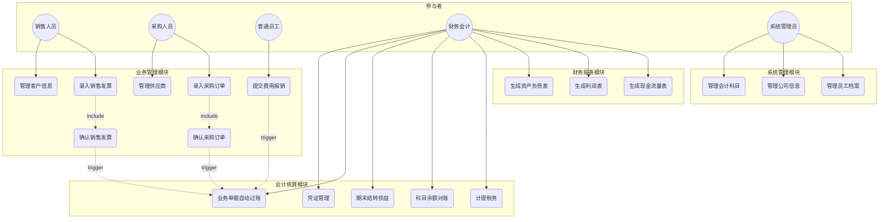
```mermaid
graph TD
    %% 定义参与者角色 (使用不同的形状区分)
    subgraph Actors [参与者]
        SalesRep((销售人员))
        Purchaser((采购人员))
        Employee((普通员工))
        Accountant((财务会计))
        Admin((系统管理员))
    end

    subgraph "业务管理模块"
        UC_Customer(管理客户信息)
        UC_SalesInvoice(录入销售发票)
        UC_ConfirmSales(确认销售发票)
        UC_Supplier(管理供应商)
        UC_PurchaseOrder(录入采购订单)
        UC_ConfirmPurchase(确认采购订单)
        UC_Expense(提交费用报销)
    end

    subgraph "会计核算模块"
        UC_Voucher(凭证管理)
        UC_AutoPost(业务单据自动过账)
        UC_PeriodEnd(期末结转损益)
        UC_Reconcile(科目余额对账)
        UC_Tax(计提税务)
    end

    subgraph "财务报表模块"
        UC_BalanceSheet(生成资产负债表)
        UC_Income(生成利润表)
        UC_CashFlow(生成现金流量表)
    end

    subgraph "系统管理模块"
        UC_Subject(管理会计科目)
        UC_Company(管理公司信息)
        UC_EmpManage(管理员工档案)
    end

    %% 业务连线
    SalesRep --> UC_Customer
    SalesRep --> UC_SalesInvoice
    UC_SalesInvoice -.->|include| UC_ConfirmSales
    
    Purchaser --> UC_Supplier
    Purchaser --> UC_PurchaseOrder
    UC_PurchaseOrder -.->|include| UC_ConfirmPurchase

    Employee --> UC_Expense

    Accountant --> UC_Voucher
    Accountant --> UC_AutoPost
    Accountant --> UC_PeriodEnd
    Accountant --> UC_Reconcile
    Accountant --> UC_Tax
    Accountant --> UC_BalanceSheet
    Accountant --> UC_Income
    Accountant --> UC_CashFlow

    %% 跨模块触发关系
    UC_ConfirmSales -.->|trigger| UC_AutoPost
    UC_ConfirmPurchase -.->|trigger| UC_AutoPost
    UC_Expense -.->|trigger| UC_AutoPost

    Admin --> UC_Subject
    Admin --> UC_Company
    Admin --> UC_EmpManage
```


## 三、用例规约

本章节依据系统 Controller 层源代码详细定义了系统功能规约。所有用例均通过 RESTful API 接口暴露服务，涵盖了从基础数据维护、日常业务处理、核心会计核算到财务报表生成的全过程。

### 3.1 系统基础设置模块

#### UC-SYS-01: 企业主体信息维护

| 规约项     | 内容                                                     |
| -------------- | ------------------------------------------------------------ |
| 用例编号   | UC-SYS-01                                                    |
| 用例名称   | 企业主体信息维护                                             |
| 执行者     | 系统管理员                                                   |
| 涉及类     | `CompanyController`                                          |
| 前置条件   | 管理员已登录。                                               |
| 后置条件   | 企业基础信息更新，影响报表表头及打印信息。                   |
| 主成功场景 | 1. [查询] 客户端调用 `GET /company/list`，系统返回企业列表（通常为单记录）。<br>2. [更新] 管理员修改企业名称、税号或地址，客户端发送 `PUT /company` 请求。 <br/>3. 控制器调用 Service 更新数据。 <br/>4. 系统返回 `Result.success("企业信息更新成功")`。 |
| 替代流程   | 1a. [新建] 若系统初始化，调用 `POST /company` 创建首条企业记录。 |

#### UC-SYS-02: 员工档案管理

| 规约项     | 内容                                                     |
| -------------- | ------------------------------------------------------------ |
| 用例编号   | UC-SYS-02                                                    |
| 用例名称   | 员工档案管理                                                 |
| 执行者     | 人事/财务人员                                                |
| 涉及类     | `EmployeeController`                                         |
| 前置条件   | 无。                                                         |
| 后置条件   | 员工档案建立，可用于报销单关联。                             |
| 主成功场景 | 1. [列表] 客户端调用 `GET /employee/list` 获取全员列表。 <br/>2. [新建] 客户端发送 `POST /employee` 提交员工对象（含工号、姓名）。 <br/>3. 控制器校验工号唯一性：`employeeMapper.checkCodeExists`。 <br/>4. 校验通过，执行插入，返回“员工创建成功”。 |
| 异常流程   | 3a. [校验失败] 若工号已存在，控制器直接返回 `Result.error("员工编号已存在")`，流程终止。 |

#### UC-SYS-03: 客户/供应商档案管理

| 规约项     | 内容                                                     |
| -------------- | ------------------------------------------------------------ |
| 用例编号   | UC-SYS-03                                                    |
| 用例名称   | 往来单位管理（客户/供应商）                                  |
| 执行者     | 销售/采购/财务人员                                           |
| 涉及类     | `CustomerController`, `SupplierController`                   |
| 前置条件   | 无。                                                         |
| 后置条件   | 往来单位档案建立，用于业务单据录入。                         |
| 主成功场景 | 1. [新建客户] 客户端调用 `POST /customer`，控制器检查 `checkCodeExists`，若无重复则创建。 <br/>2. [新建供应商] 客户端调用 `POST /supplier`，控制器检查供应商编号唯一性，若无重复则创建。 3. [更新] 调用对应的 `PUT` 接口更新联系人或地址信息。 <br/>4. [删除] 调用 `DELETE /{id}` 移除无效档案。 |
| 业务规则   | 客户编号与供应商编号在各自体系内必须唯一。                   |

#### UC-SYS-04: 会计科目体系配置

| 规约项     | 内容                                                     |
| -------------- | ------------------------------------------------------------ |
| 用例编号   | UC-SYS-04                                                    |
| 用例名称   | 会计科目体系配置                                             |
| 执行者     | 财务主管                                                     |
| 涉及类     | `AccountSubjectController`                                   |
| 前置条件   | 无。                                                         |
| 后置条件   | 科目表更新，直接影响凭证录入的科目选择。                     |
| 主成功场景 | 1. [获取树形/列表] 调用 `GET /account-subject/list` 获取全量科目。 <br/>2. [获取子级] 调用 `GET /account-subject/children/{parentId}` 逐级加载。 <br/>3. [记账筛选] 凭证录入界面调用 `GET /account-subject/leaf`，仅获取“启用的叶子科目”。 <br/>4. [新建/更新] 调用 `POST` 或 `PUT` 接口维护科目属性（如借贷方向、辅助核算）。 |

### 3.2 业务管理模块

#### UC-BUS-01: 销售发票全流程

| 规约项     | 内容                                                     |
| -------------- | ------------------------------------------------------------ |
| 用例编号   | UC-BUS-01                                                    |
| 用例名称   | 销售发票录入与确认                                           |
| 执行者     | 销售人员                                                     |
| 涉及类     | `SalesInvoiceController`                                     |
| 前置条件   | 客户档案已存在。                                             |
| 后置条件   | 发票状态由 `Draft` 变更为 `Confirmed`，进入待过账队列。      |
| 主成功场景 | 1. [查询] 调用 `GET /sales/list` 按关键字或状态（如 Draft）筛选发票。 <br/>2. [保存草稿] 调用 `POST /sales` 提交发票头及明细，状态默认为 `Draft`。 <br/>3. [修改] 在确认前，可调用 `PUT /sales` 修改发票金额或明细。 <br/>4. [确认] 用户点击确认，客户端调用 `PUT /sales/{id}/confirm`。 <br/>5. 系统锁定单据，状态更新为 `Confirmed`。 |

#### UC-BUS-02: 采购订单全流程

| 规约项     | 内容                                                     |
| -------------- | ------------------------------------------------------------ |
| 用例编号   | UC-BUS-02                                                    |
| 用例名称   | 采购订单录入与确认                                           |
| 执行者     | 采购人员                                                     |
| 涉及类     | `PurchaseOrderController`                                    |
| 前置条件   | 供应商档案已存在。                                           |
| 后置条件   | 订单状态更新为 `Confirmed`。                                 |
| 主成功场景 | 1. [保存订单] 调用 `POST /purchase-order` 接收 `PurchaseOrderRequest`（含主表与明细 List），返回订单 ID。 <br/>2. [查看明细] 调用 `GET /purchase-order/{id}/items` 获取商品详情。 <br/>3. [确认] 调用 `PUT /purchase-order/{id}/confirm` 完成业务确认。 <br/>4. [待过账查询] 财务人员可调用 `GET /purchase-order/unposted` 获取所有已确认但未生成凭证的订单。 |

#### UC-BUS-03: 费用报销审批流

| 规约项     | 内容                                                     |
| -------------- | ------------------------------------------------------------ |
| 用例编号   | UC-BUS-03                                                    |
| 用例名称   | 费用报销申请与审批                                           |
| 执行者     | 员工（申请）、主管/财务（审批）                              |
| 涉及类     | `ExpenseClaimController`                                     |
| 前置条件   | 员工已登录。                                                 |
| 后置条件   | 报销单状态终结为 `Approved` 或 `Rejected`。                  |
| 主成功场景 | 1. [提交申请] 员工调用 `POST /expense` 创建草稿，随后调用 `PUT /expense/{id}/submit` 提交审批。 <br/>2. [审批通过] 审批人调用 `PUT /expense/{id}/approve`，状态变为 `Approved`，允许过账。 <br/>3. [审批拒绝] 审批人调用 `PUT /expense/{id}/reject`，并在请求体中附带 `{"reason": "..."}`。 <br/>4. 系统更新状态为 `Rejected` 并记录原因。 |

### 3.3 总账会计核算模块

#### UC-ACC-01: 业务智能过账

| 规约项     | 内容                                                     |
| -------------- | ------------------------------------------------------------ |
| 用例编号   | UC-ACC-01                                                    |
| 用例名称   | 业务单据智能过账（单笔/批量）                                |
| 执行者     | 财务会计                                                     |
| 涉及类     | `PostingController`                                          |
| 前置条件   | 业务单据处于 `Confirmed` 或 `Approved` 状态。                |
| 后置条件   | 自动生成会计凭证，业务单据标记为已过账。                     |
| 主成功场景 | 1. [采购过账] 调用 `POST /posting/purchase/{orderId}` 对单笔订单生成凭证。 <br/>2. [销售过账] 调用 `POST /posting/sales/{invoiceId}` 对单笔发票生成凭证。 <br/>3. [报销过账] 调用 `POST /posting/expense/{claimId}` 对报销单生成凭证。 <br/>4. [批量处理] 客户端组装 ID 列表，调用 `/batch` 接口（如 `/posting/purchase/batch`），系统循环处理并返回生成的凭证 ID 列表。 |

#### UC-ACC-02: 凭证全生命周期管理

| 规约项     | 内容                                                     |
| -------------- | ------------------------------------------------------------ |
| 用例编号   | UC-ACC-02                                                    |
| 用例名称   | 凭证录入、查询与记账                                         |
| 执行者     | 财务会计                                                     |
| 涉及类     | `VoucherController`                                          |
| 前置条件   | 科目已配置。                                                 |
| 后置条件   | 凭证数据持久化并登入总账。                                   |
| 主成功场景 | 1. [组合查询] 调用 `GET /voucher/list`，支持按日期范围、关键字、凭证状态筛选。 <br/>2. [录入凭证] 调用 `POST /voucher`，提交 `VoucherRequest`（含凭证头 Voucher 和分录列表 entries）。 <br/>3. [获取分录] 点击详情，调用 `GET /voucher/{id}/entries` 回显分录。 <br/>4. [审核记账] 调用 `POST /voucher/{id}/post`，系统校验借贷平衡后将状态置为 `Posted`。 <br/>5. [删除] 仅对未记账凭证调用 `DELETE /voucher/{id}`。 |

#### UC-ACC-03: 银行/现金自动对账

| 规约项     | 内容                                                     |
| -------------- | ------------------------------------------------------------ |
| 用例编号   | UC-ACC-03                                                    |
| 用例名称   | 资金科目对账                                                 |
| 执行者     | 出纳                                                         |
| 涉及类     | `ReconciliationController`                                   |
| 前置条件   | 系统中存在资金类科目的凭证记录。                             |
| 后置条件   | 生成对账单，明确账实差异。                                   |
| 主成功场景 | 1. [获取账面余额] 客户端调用 `GET /reconciliation/subject-balance/{subjectId}`，系统根据所有过账凭证计算截止日期的理论余额。 <br/>2. [执行自动对账] 调用 `POST /reconciliation/auto`，传入对账日期。 <br/>3. 系统自动拉取所有资金科目余额，生成初始对账单。 <br/>4. [录入实存] 用户调用 `PUT /reconciliation` 更新“银行/现金实存余额”。 <br/>5. 系统自动计算差异额。 |

#### UC-ACC-04: 定期业务处理

| 规约项     | 内容                                                     |
| -------------- | ------------------------------------------------------------ |
| 用例编号   | UC-ACC-04                                                    |
| 用例名称   | 期末结转与自动计提                                           |
| 执行者     | 财务主管                                                     |
| 涉及类     | `PeriodicOperationController`                                |
| 前置条件   | 本期日常业务已处理完毕。                                     |
| 后置条件   | 生成折旧、摊销或损益结转的自动凭证。                         |
| 主成功场景 | 1. [查询任务] 调用 `GET /periodic/list` 查看待执行的定期操作（如“计提折旧”、“期末损益结转”）。 <br/>2. [执行任务] 调用 `PUT /periodic/{id}/execute`。 <br/>3. 系统根据预设规则生成凭证，并返回凭证 ID。 4. 任务状态更新为 `Executed`。 |

#### UC-ACC-05: 税务管理

| 规约项     | 内容                                                     |
| -------------- | ------------------------------------------------------------ |
| 用例编号   | UC-ACC-05                                                    |
| 用例名称   | 税务申报与缴纳                                               |
| 执行者     | 税务会计                                                     |
| 涉及类     | `TaxRecordController`                                        |
| 前置条件   | 税务数据已生成。                                             |
| 后置条件   | 税务记录状态流转。                                           |
| 主成功场景 | 1. [查询记录] 调用 `GET /tax/list` 获取本期税务记录。 <br/>2. [申报] 确认无误后，调用 `PUT /tax/{id}/declare`，状态变更为 `Declared`。 <br/>3. [缴纳] 实际缴款后，调用 `PUT /tax/{id}/pay`，状态变更为 `Paid`。 |

### 3.4 财务报表模块

#### UC-RPT-01: 资产负债表生成与导出

| 规约项     | 内容                                                     |
| -------------- | ------------------------------------------------------------ |
| 用例编号   | UC-RPT-01                                                    |
| 用例名称   | 资产负债表生成与导出                                         |
| 执行者     | 财务经理/管理层                                              |
| 涉及类     | `FinancialReportController`                                  |
| 前置条件   | 凭证已过账且期末结转完成。                                   |
| 后置条件   | 报表展示或文件下载。                                         |
| 主成功场景 | 1. [预览] 客户端传入 `endDate`，调用 `GET /report/balance-sheet`。系统返回包含资产、负债、权益结构的 JSON 数据。 <br/>2. [导出] 客户端调用 `GET /report/balance-sheet/export`。 <br/>3. 系统生成 `.xlsx` 文件流，设置响应头为 `application/vnd.openxmlformats...`，触发浏览器下载。 |

#### UC-RPT-02: 利润表生成与导出

| 规约项     | 内容                                                     |
| -------------- | ------------------------------------------------------------ |
| 用例编号   | UC-RPT-02                                                    |
| 用例名称   | 利润表生成与导出                                             |
| 执行者     | 财务经理/管理层                                              |
| 涉及类     | `FinancialReportController`                                  |
| 前置条件   | 期间损益类科目有发生额。                                     |
| 后置条件   | 报表展示或文件下载。                                         |
| 主成功场景 | 1. [预览] 客户端传入 `startDate` 和 `endDate`，调用 `GET /report/income-statement`。 <br/>2. [导出] 调用对应的 `/export` 接口下载 Excel 版本。 |

#### UC-RPT-03: 现金流量表生成与导出

| 规约项     | 内容                                                     |
| -------------- | ------------------------------------------------------------ |
| 用例编号   | UC-RPT-03                                                    |
| 用例名称   | 现金流量表生成与导出                                         |
| 执行者     | 财务经理/管理层                                              |
| 涉及类     | `FinancialReportController`                                  |
| 前置条件   | 现金类凭证数据完整。                                         |
| 后置条件   | 报表展示或文件下载。                                         |
| 主成功场景 | 1. [预览] 客户端传入时间范围，调用 `GET /report/cash-flow`。 <br/>2. 系统自动计算经营、投资、筹资三类活动现金流。 <br/>3. [导出] 调用 `/export` 接口下载 Excel 报表。 |


## 四、分析类图

本章节基于系统实体类（Entity）代码，构建系统的静态结构模型。分析类图展示了系统中的核心类、类的内部结构（属性）以及类与类之间的关联、聚合和组合关系，为数据库设计和编码实现提供直接依据。

### 4.1 分析概览

系统采用典型的领域驱动设计（DDD）思想，将实体划分为 基础档案、业务单据、会计核算 和 报表分析 四大域。

- 基础档案域：`Company`, `Employee`, `Customer`, `Supplier`, `AccountSubject`
- 业务单据域：`SalesInvoice`, `PurchaseOrder`, `ExpenseClaim` (及其明细 Item)
- 会计核算域：`Voucher`, `VoucherEntry`, `PostingRecord`
- 报表与处理域：`Reconciliation`, `TaxRecord`, `PeriodicOperation`, `CashFlowItem`

### 4.2 系统分析类图 

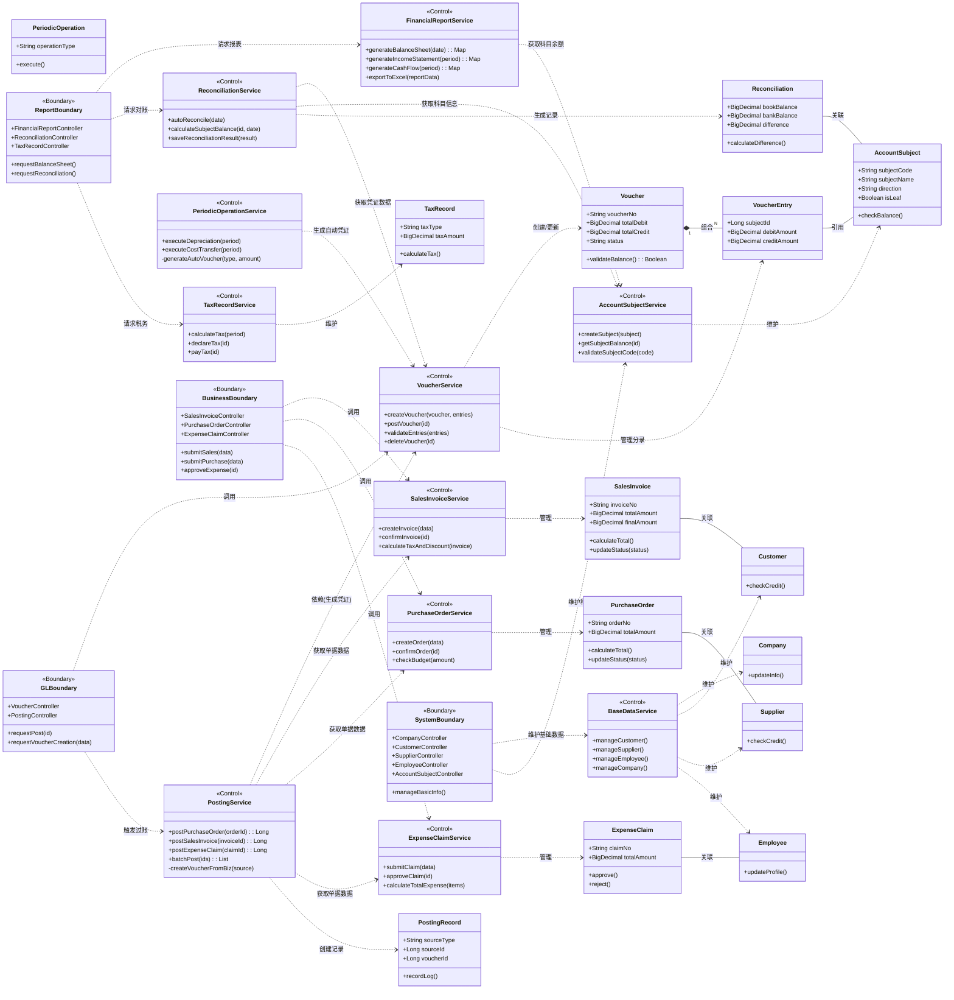
```mermaid
classDiagram
    direction LR

    %% ==========================================
    %% 1. 实体类 (Entity Classes) - 承载数据
    %% ==========================================
    class AccountSubject {
        +String subjectCode
        +String subjectName
        +String direction
        +Boolean isLeaf
        +checkBalance()
    }

    class Voucher {
        +String voucherNo
        +BigDecimal totalDebit
        +BigDecimal totalCredit
        +String status
        +validateBalance() : Boolean
    }

    class VoucherEntry {
        +Long subjectId
        +BigDecimal debitAmount
        +BigDecimal creditAmount
    }

    class SalesInvoice {
        +String invoiceNo
        +BigDecimal totalAmount
        +BigDecimal finalAmount
        +calculateTotal()
        +updateStatus(status)
    }

    class PurchaseOrder {
        +String orderNo
        +BigDecimal totalAmount
        +calculateTotal()
        +updateStatus(status)
    }

    class ExpenseClaim {
        +String claimNo
        +BigDecimal totalAmount
        +approve()
        +reject()
    }

    class PostingRecord {
        +String sourceType
        +Long sourceId
        +Long voucherId
        +recordLog()
    }

    class Reconciliation {
        +BigDecimal bookBalance
        +BigDecimal bankBalance
        +BigDecimal difference
        +calculateDifference()
    }

    class TaxRecord {
        +String taxType
        +BigDecimal taxAmount
        +calculateTax()
    }

    class PeriodicOperation {
        +String operationType
        +execute()
    }

    class Company { +updateInfo() }
    class Customer { +checkCredit() }
    class Supplier { +checkCredit() }
    class Employee { +updateProfile() }

    %% ==========================================
    %% 2. 控制类 (Control Classes) - 业务逻辑核心
    %% ==========================================
    class PostingService {
        <<Control>>
        +postPurchaseOrder(orderId) : Long
        +postSalesInvoice(invoiceId) : Long
        +postExpenseClaim(claimId) : Long
        +batchPost(ids) : List
        -createVoucherFromBiz(source)
    }

    class VoucherService {
        <<Control>>
        +createVoucher(voucher, entries)
        +postVoucher(id)
        +validateEntries(entries)
        +deleteVoucher(id)
    }

    class AccountSubjectService {
        <<Control>>
        +createSubject(subject)
        +getSubjectBalance(id)
        +validateSubjectCode(code)
    }

    class FinancialReportService {
        <<Control>>
        +generateBalanceSheet(date) : Map
        +generateIncomeStatement(period) : Map
        +generateCashFlow(period) : Map
        +exportToExcel(reportData)
    }

    class ReconciliationService {
        <<Control>>
        +autoReconcile(date)
        +calculateSubjectBalance(id, date)
        +saveReconciliationResult(result)
    }

    class PeriodicOperationService {
        <<Control>>
        +executeDepreciation(period)
        +executeCostTransfer(period)
        -generateAutoVoucher(type, amount)
    }

    class SalesInvoiceService {
        <<Control>>
        +createInvoice(data)
        +confirmInvoice(id)
        +calculateTaxAndDiscount(invoice)
    }

    class PurchaseOrderService {
        <<Control>>
        +createOrder(data)
        +confirmOrder(id)
        +checkBudget(amount)
    }

    class ExpenseClaimService {
        <<Control>>
        +submitClaim(data)
        +approveClaim(id)
        +calculateTotalExpense(items)
    }
    
    class TaxRecordService {
        <<Control>>
        +calculateTax(period)
        +declareTax(id)
        +payTax(id)
    }

    class BaseDataService {
        <<Control>>
        +manageCustomer()
        +manageSupplier()
        +manageEmployee()
        +manageCompany()
    }

    %% ==========================================
    %% 3. 边界类 (Boundary Classes) - API/UI入口
    %% ==========================================
    class GLBoundary {
        <<Boundary>>
        +VoucherController
        +PostingController
        +requestPost(id)
        +requestVoucherCreation(data)
    }

    class ReportBoundary {
        <<Boundary>>
        +FinancialReportController
        +ReconciliationController
        +TaxRecordController
        +requestBalanceSheet()
        +requestReconciliation()
    }

    class BusinessBoundary {
        <<Boundary>>
        +SalesInvoiceController
        +PurchaseOrderController
        +ExpenseClaimController
        +submitSales(data)
        +submitPurchase(data)
        +approveExpense(id)
    }

    class SystemBoundary {
        <<Boundary>>
        +CompanyController
        +CustomerController
        +SupplierController
        +EmployeeController
        +AccountSubjectController
        +manageBasicInfo()
    }

    %% ==========================================
    %% 4. 关系定义 (Relationships)
    %% ==========================================

    %% 4.1 边界 -> 控制 (调用关系)
    GLBoundary ..> VoucherService : 调用
    GLBoundary ..> PostingService : 触发过账
    
    ReportBoundary ..> FinancialReportService : 请求报表
    ReportBoundary ..> ReconciliationService : 请求对账
    ReportBoundary ..> TaxRecordService : 请求税务
    
    BusinessBoundary ..> SalesInvoiceService : 调用
    BusinessBoundary ..> PurchaseOrderService : 调用
    BusinessBoundary ..> ExpenseClaimService : 调用

    SystemBoundary ..> BaseDataService : 维护基础数据
    SystemBoundary ..> AccountSubjectService : 维护科目

    %% 4.2 控制 -> 控制 (协作关系)
    PostingService ..> VoucherService : 依赖(生成凭证)
    PostingService ..> SalesInvoiceService : 获取单据数据
    PostingService ..> PurchaseOrderService : 获取单据数据
    PostingService ..> ExpenseClaimService : 获取单据数据
    
    ReconciliationService ..> VoucherService : 获取凭证数据
    ReconciliationService ..> AccountSubjectService : 获取科目信息
    
    PeriodicOperationService ..> VoucherService : 生成自动凭证
    FinancialReportService ..> AccountSubjectService : 获取科目余额

    %% 4.3 控制 -> 实体 (CRUD关系)
    VoucherService ..> Voucher : 创建/更新
    VoucherService ..> VoucherEntry : 管理分录
    
    PostingService ..> PostingRecord : 创建记录
    
    SalesInvoiceService ..> SalesInvoice : 管理
    PurchaseOrderService ..> PurchaseOrder : 管理
    ExpenseClaimService ..> ExpenseClaim : 管理
    
    AccountSubjectService ..> AccountSubject : 维护
    ReconciliationService ..> Reconciliation : 生成记录
    TaxRecordService ..> TaxRecord : 维护

    BaseDataService ..> Company : 维护
    BaseDataService ..> Customer : 维护
    BaseDataService ..> Supplier : 维护
    BaseDataService ..> Employee : 维护

    %% 4.4 实体间结构关系
    Voucher "1" *-- "N" VoucherEntry : 组合
    SalesInvoice -- Customer : 关联
    PurchaseOrder -- Supplier : 关联
    ExpenseClaim -- Employee : 关联
    VoucherEntry -- AccountSubject : 引用
    Reconciliation -- AccountSubject : 关联
```

### 4.3 核心类详解

#### 4.3.1 会计科目类 (AccountSubject)

- 职责：定义企业的会计核算维度，是财务系统的基础。
- 关键属性：
  - `subjectCode`: 科目编码（如 1001, 1002），具有唯一性。
  - `direction`: 余额方向（借/贷），决定金额增加的记账方向。
  - `isLeaf`: 是否叶子节点，强制规定只有 `true` 的科目才能被 `VoucherEntry` 引用。
- 关系：自关联（Self-reference），通过 `parentId` 构建无限层级的树形结构。

#### 4.3.2 凭证与分录类 (Voucher & VoucherEntry)

- 职责：`Voucher` 是会计信息的载体，记录经济业务；`VoucherEntry` 是凭证的具体行，记录科目和金额。
- 组合关系：`Voucher` 与 `VoucherEntry` 构成强组合关系（Composition）。凭证删除时，其分录也随之删除。
- 业务规则：
  - `totalDebit` 必须等于 `totalCredit`。
  - `sourceType` 和 `sourceId` 实现了凭证对上游业务单据的多态引用。

#### 4.3.3 业务单据类 (Sales/Purchase/Expense)

这三组类（`SalesInvoice`, `PurchaseOrder`, `ExpenseClaim`）结构相似，均采用 主子表（Header-Line） 设计模式。

- 主表：存储单据编号、日期、总金额、状态（Draft/Confirmed/Posted）、往来单位ID。
- 子表：存储商品明细、数量、单价、税率等。
- 状态机：`isPosted` (Boolean): 关键标志位，用于控制业务单据是否已生成凭证，防止重复记账。

#### 4.3.4 过账与对账类

- PostingRecord：作为中间表，连接业务单据与会计凭证，提供审计追踪能力（Audit Trail）。它记录了“哪张单据”在“什么时间”由“谁”生成了“哪张凭证”。
- Reconciliation：记录账面余额与实物/银行余额的核对结果，`differenceAmount` 用于标记差异。

### 4.4 类间关系分析

1. 业务与财务的解耦：

   系统没有在业务单据表中直接硬编码会计科目，而是通过 PostingService (服务层) 在运行时动态匹配科目生成 Voucher。类图中，业务实体（如 SalesInvoice）与会计实体（Voucher）通过 PostingRecord 或 ID 引用进行松散耦合。

2. 科目的引用约束：

   VoucherEntry 通过 subjectId 关联 AccountSubject。这种设计确保了如果科目属性发生变更（如改名），历史凭证数据的引用依然有效，但也要求删除科目时必须进行引用检查（Referential Integrity）。

3. 多态的来源追踪：

   Voucher 类中的 sourceType (String) 和 sourceId (Long) 是一种轻量级的多态关联设计。它允许凭证来源于 PurchaseOrder、SalesInvoice、ExpenseClaim 或 PeriodicOperation，而无需建立复杂的继承体系。


## 五、分析序列图

本章节依据系统用例规约，展示了系统核心功能的动态交互视图。

设计说明：

- 交互链路：`Controller (接收请求)` $\rightarrow$ `Service (业务逻辑)` $\rightarrow$ `Mapper (持久化)` $\rightarrow$ `Database (数据库)`。
- 图例说明：图中不仅包含代码级的方法调用，还通过 [中文方括号] 标注了业务含义，并通过 便签 (Note) 解释了核心计算规则和校验逻辑。

### 5.1 系统管理模块

#### 5.1.1 企业主体信息维护 (UC-SYS-01)

场景：管理员查看并修改公司基本信息（如注册资本、地址），该信息将用于报表打印。

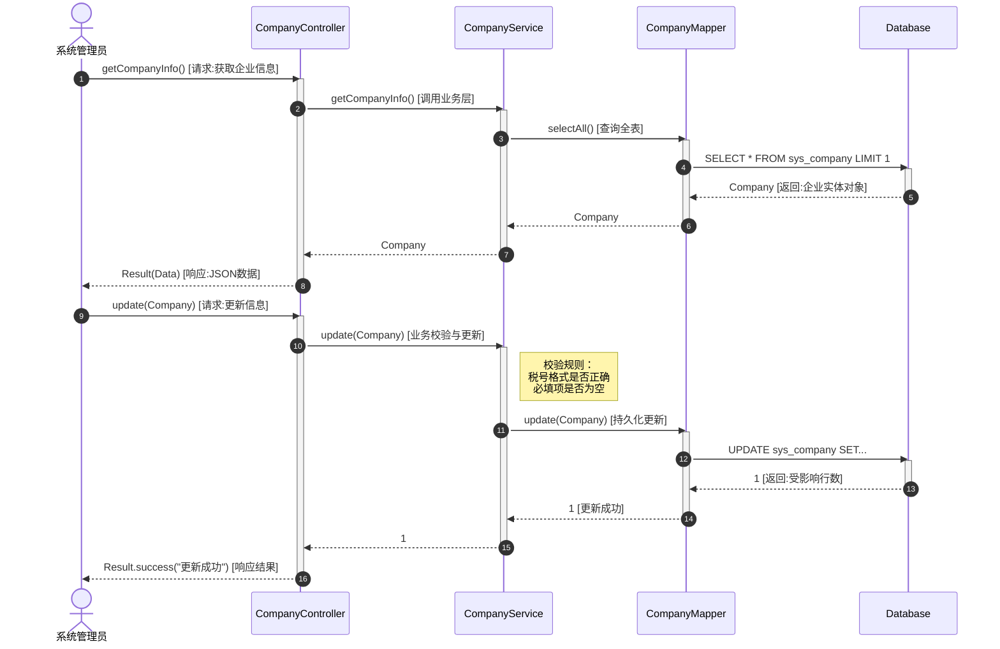
```mermaid
sequenceDiagram
    autonumber
    actor Admin as 系统管理员
    participant Ctrl as CompanyController
    participant Svc as CompanyService
    participant Mapper as CompanyMapper
    participant DB as Database

    %% --- 阶段1：数据回显 ---
    Admin->>Ctrl: getCompanyInfo() [请求:获取企业信息]
    activate Ctrl
    Ctrl->>Svc: getCompanyInfo() [调用业务层]
    activate Svc
    Svc->>Mapper: selectAll() [查询全表]
    activate Mapper
    Mapper->>DB: SELECT * FROM sys_company LIMIT 1
    activate DB
    DB-->>Mapper: Company [返回:企业实体对象]
    deactivate DB
    Mapper-->>Svc: Company
    deactivate Mapper
    Svc-->>Ctrl: Company
    deactivate Svc
    Ctrl-->>Admin: Result(Data) [响应:JSON数据]
    deactivate Ctrl

    %% --- 阶段2：信息更新 ---
    Admin->>Ctrl: update(Company) [请求:更新信息]
    activate Ctrl
    Ctrl->>Svc: update(Company) [业务校验与更新]
    activate Svc
    
    note right of Svc: 校验规则：<br/>税号格式是否正确<br/>必填项是否为空
    
    Svc->>Mapper: update(Company) [持久化更新]
    activate Mapper
    Mapper->>DB: UPDATE sys_company SET...
    activate DB
    DB-->>Mapper: 1 [返回:受影响行数]
    deactivate DB
    Mapper-->>Svc: 1 [更新成功]
    deactivate Mapper
    Svc-->>Ctrl: 1
    deactivate Svc
    Ctrl-->>Admin: Result.success("更新成功") [响应结果]
    deactivate Ctrl
```

#### 5.1.2 员工档案管理 (UC-SYS-02)

场景：HR录入新员工，系统需严格校验工号唯一性，防止数据冲突。

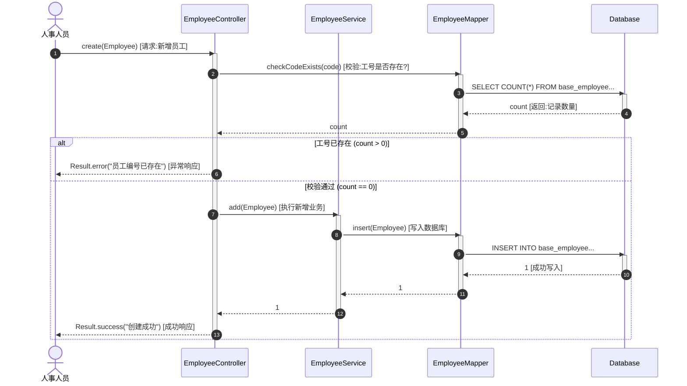
```mermaid
sequenceDiagram
    autonumber
    actor HR as 人事人员
    participant Ctrl as EmployeeController
    participant Svc as EmployeeService
    participant Mapper as EmployeeMapper
    participant DB as Database

    HR->>Ctrl: create(Employee) [请求:新增员工]
    activate Ctrl
    
    %% 业务规则校验
    Ctrl->>Mapper: checkCodeExists(code) [校验:工号是否存在?]
    activate Mapper
    Mapper->>DB: SELECT COUNT(*) FROM base_employee...
    activate DB
    DB-->>Mapper: count [返回:记录数量]
    deactivate DB
    Mapper-->>Ctrl: count
    deactivate Mapper

    alt 工号已存在 (count > 0)
        Ctrl-->>HR: Result.error("员工编号已存在") [异常响应]
    else 校验通过 (count == 0)
        Ctrl->>Svc: add(Employee) [执行新增业务]
        activate Svc
        Svc->>Mapper: insert(Employee) [写入数据库]
        activate Mapper
        Mapper->>DB: INSERT INTO base_employee...
        activate DB
        DB-->>Mapper: 1 [成功写入]
        deactivate DB
        Mapper-->>Svc: 1
        deactivate Mapper
        Svc-->>Ctrl: 1
        deactivate Svc
        Ctrl-->>HR: Result.success("创建成功") [成功响应]
    end
    deactivate Ctrl
```

#### 5.1.3 客户/供应商档案管理 (UC-SYS-03)

场景：录入客户档案，包含基础信息查重校验。

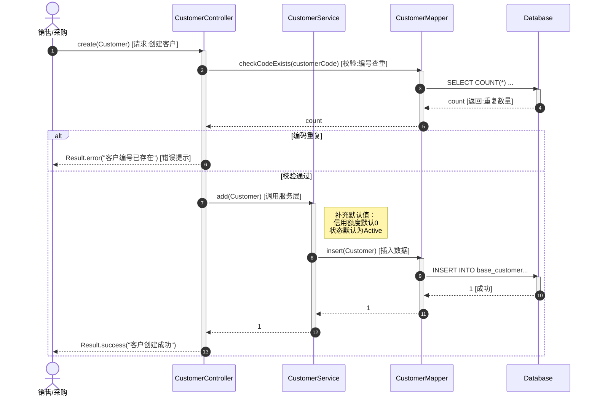
```mermaid
sequenceDiagram
    autonumber
    actor Sales as 销售/采购
    participant Ctrl as CustomerController
    participant Svc as CustomerService
    participant Mapper as CustomerMapper
    participant DB as Database

    Sales->>Ctrl: create(Customer) [请求:创建客户]
    activate Ctrl
    
    Ctrl->>Mapper: checkCodeExists(customerCode) [校验:编号查重]
    activate Mapper
    Mapper->>DB: SELECT COUNT(*) ...
    activate DB
    DB-->>Mapper: count [返回:重复数量]
    deactivate DB
    Mapper-->>Ctrl: count
    deactivate Mapper

    alt 编码重复
        Ctrl-->>Sales: Result.error("客户编号已存在") [错误提示]
    else 校验通过
        Ctrl->>Svc: add(Customer) [调用服务层]
        activate Svc
        
        note right of Svc: 补充默认值：<br/>信用额度默认0<br/>状态默认为Active
        
        Svc->>Mapper: insert(Customer) [插入数据]
        activate Mapper
        Mapper->>DB: INSERT INTO base_customer...
        activate DB
        DB-->>Mapper: 1 [成功]
        deactivate DB
        Mapper-->>Svc: 1
        deactivate Mapper
        Svc-->>Ctrl: 1
        deactivate Svc
        Ctrl-->>Sales: Result.success("客户创建成功")
    end
    deactivate Ctrl
```

#### 5.1.4 会计科目体系配置 (UC-SYS-04)

场景：财务建立新的二级科目，系统需验证父级科目合法性，维护树形结构。

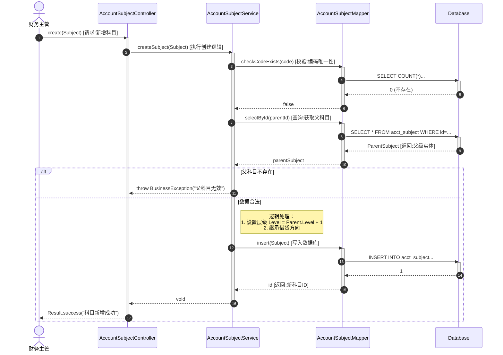
```mermaid
sequenceDiagram
    autonumber
    actor Fin as 财务主管
    participant Ctrl as AccountSubjectController
    participant Svc as AccountSubjectService
    participant Mapper as AccountSubjectMapper
    participant DB as Database

    Fin->>Ctrl: create(Subject) [请求:新增科目]
    activate Ctrl
    Ctrl->>Svc: createSubject(Subject) [执行创建逻辑]
    activate Svc

    %% 校验逻辑
    Svc->>Mapper: checkCodeExists(code) [校验:编码唯一性]
    activate Mapper
    Mapper->>DB: SELECT COUNT(*)...
    activate DB
    DB-->>Mapper: 0 (不存在)
    deactivate DB
    Mapper-->>Svc: false
    deactivate Mapper

    Svc->>Mapper: selectById(parentId) [查询:获取父科目]
    activate Mapper
    Mapper->>DB: SELECT * FROM acct_subject WHERE id=...
    activate DB
    DB-->>Mapper: ParentSubject [返回:父级实体]
    deactivate DB
    Mapper-->>Svc: parentSubject
    deactivate Mapper

    alt 父科目不存在
        Svc-->>Ctrl: throw BusinessException("父科目无效")
    else 数据合法
        note right of Svc: 逻辑处理：<br/>1. 设置层级 Level = Parent.Level + 1<br/>2. 继承借贷方向
        Svc->>Mapper: insert(Subject) [写入数据库]
        activate Mapper
        Mapper->>DB: INSERT INTO acct_subject...
        activate DB
        DB-->>Mapper: 1
        deactivate DB
        Mapper-->>Svc: id [返回:新科目ID]
        deactivate Mapper
        Svc-->>Ctrl: void
        deactivate Svc
        Ctrl-->>Fin: Result.success("科目新增成功")
    end
    deactivate Ctrl
```

### 5.2 业务管理模块

#### 5.2.1 销售发票全流程 (UC-BUS-01)

场景：销售录入发票（主表）及商品明细（子表），并进行单据确认。包含金额自动计算。

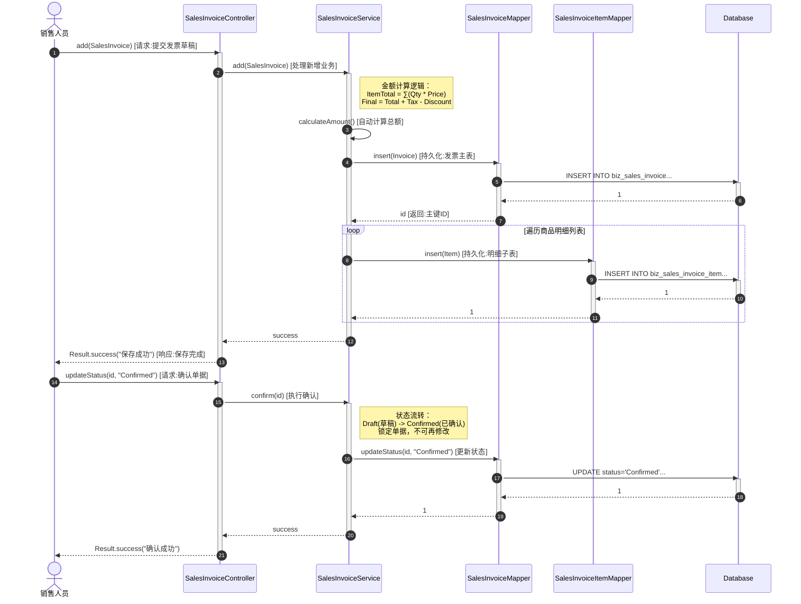
```mermaid
sequenceDiagram
    autonumber
    actor User as 销售人员
    participant Ctrl as SalesInvoiceController
    participant Svc as SalesInvoiceService
    participant Mapper as SalesInvoiceMapper
    participant ItemMapper as SalesInvoiceItemMapper
    participant DB as Database

    %% --- 阶段1：保存草稿 ---
    User->>Ctrl: add(SalesInvoice) [请求:提交发票草稿]
    activate Ctrl
    Ctrl->>Svc: add(SalesInvoice) [处理新增业务]
    activate Svc
    
    note right of Svc: 金额计算逻辑：<br/>ItemTotal = ∑(Qty * Price)<br/>Final = Total + Tax - Discount
    Svc->>Svc: calculateAmount() [自动计算总额]
    
    Svc->>Mapper: insert(Invoice) [持久化:发票主表]
    activate Mapper
    Mapper->>DB: INSERT INTO biz_sales_invoice...
    activate DB
    DB-->>Mapper: 1
    deactivate DB
    Mapper-->>Svc: id [返回:主键ID]
    deactivate Mapper

    loop 遍历商品明细列表
        Svc->>ItemMapper: insert(Item) [持久化:明细子表]
        activate ItemMapper
        ItemMapper->>DB: INSERT INTO biz_sales_invoice_item...
        activate DB
        DB-->>ItemMapper: 1
        deactivate DB
        ItemMapper-->>Svc: 1
        deactivate ItemMapper
    end
    Svc-->>Ctrl: success
    deactivate Svc
    Ctrl-->>User: Result.success("保存成功") [响应:保存完成]
    deactivate Ctrl

    %% --- 阶段2：确认生效 ---
    User->>Ctrl: updateStatus(id, "Confirmed") [请求:确认单据]
    activate Ctrl
    Ctrl->>Svc: confirm(id) [执行确认]
    activate Svc
    
    note right of Svc: 状态流转：<br/>Draft(草稿) -> Confirmed(已确认)<br/>锁定单据，不可再修改
    
    Svc->>Mapper: updateStatus(id, "Confirmed") [更新状态]
    activate Mapper
    Mapper->>DB: UPDATE status='Confirmed'...
    activate DB
    DB-->>Mapper: 1
    deactivate DB
    Mapper-->>Svc: 1
    deactivate Mapper
    Svc-->>Ctrl: success
    deactivate Svc
    Ctrl-->>User: Result.success("确认成功")
    deactivate Ctrl
```

#### 5.2.2 采购订单全流程 (UC-BUS-02)

场景：采购录入订单，系统自动生成单号，计算总价，并支持状态流转。

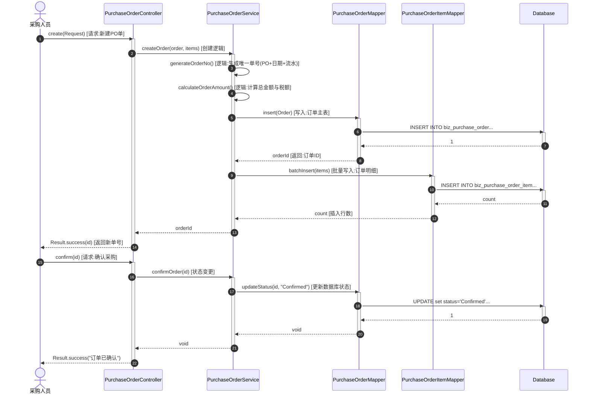
```mermaid
sequenceDiagram
    autonumber
    actor User as 采购人员
    participant Ctrl as PurchaseOrderController
    participant Svc as PurchaseOrderService
    participant Mapper as PurchaseOrderMapper
    participant ItemMapper as PurchaseOrderItemMapper
    participant DB as Database

    %% --- 创建订单 ---
    User->>Ctrl: create(Request) [请求:新建PO单]
    activate Ctrl
    Ctrl->>Svc: createOrder(order, items) [创建逻辑]
    activate Svc
    
    Svc->>Svc: generateOrderNo() [逻辑:生成唯一单号(PO+日期+流水)]
    Svc->>Svc: calculateOrderAmount() [逻辑:计算总金额与税额]
    
    Svc->>Mapper: insert(Order) [写入:订单主表]
    activate Mapper
    Mapper->>DB: INSERT INTO biz_purchase_order...
    activate DB
    DB-->>Mapper: 1
    deactivate DB
    Mapper-->>Svc: orderId [返回:订单ID]
    deactivate Mapper

    Svc->>ItemMapper: batchInsert(items) [批量写入:订单明细]
    activate ItemMapper
    ItemMapper->>DB: INSERT INTO biz_purchase_order_item...
    activate DB
    DB-->>ItemMapper: count
    deactivate DB
    ItemMapper-->>Svc: count [插入行数]
    deactivate ItemMapper

    Svc-->>Ctrl: orderId
    deactivate Svc
    Ctrl-->>User: Result.success(id) [返回新单号]
    deactivate Ctrl

    %% --- 确认订单 ---
    User->>Ctrl: confirm(id) [请求:确认采购]
    activate Ctrl
    Ctrl->>Svc: confirmOrder(id) [状态变更]
    activate Svc
    Svc->>Mapper: updateStatus(id, "Confirmed") [更新数据库状态]
    activate Mapper
    Mapper->>DB: UPDATE set status='Confirmed'...
    activate DB
    DB-->>Mapper: 1
    deactivate DB
    Mapper-->>Svc: void
    deactivate Mapper
    Svc-->>Ctrl: void
    deactivate Svc
    Ctrl-->>User: Result.success("订单已确认")
    deactivate Ctrl
```

#### 5.2.3 费用报销审批流 (UC-BUS-03)

场景：员工提交 $\rightarrow$ 经理审批。体现了多角色的状态协作。

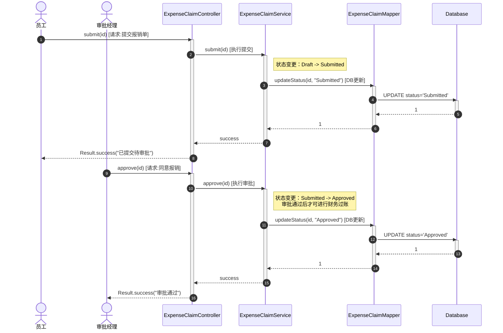
```mermaid
sequenceDiagram
    autonumber
    actor Emp as 员工
    actor Mgr as 审批经理
    participant Ctrl as ExpenseClaimController
    participant Svc as ExpenseClaimService
    participant Mapper as ExpenseClaimMapper
    participant DB as Database

    %% --- 提交环节 ---
    Emp->>Ctrl: submit(id) [请求:提交报销单]
    activate Ctrl
    Ctrl->>Svc: submit(id) [执行提交]
    activate Svc
    
    note right of Svc: 状态变更：Draft -> Submitted
    Svc->>Mapper: updateStatus(id, "Submitted") [DB更新]
    activate Mapper
    Mapper->>DB: UPDATE status='Submitted'
    activate DB
    DB-->>Mapper: 1
    deactivate DB
    Mapper-->>Svc: 1
    deactivate Mapper
    Svc-->>Ctrl: success
    deactivate Svc
    Ctrl-->>Emp: Result.success("已提交待审批")
    deactivate Ctrl

    %% --- 审批环节 ---
    Mgr->>Ctrl: approve(id) [请求:同意报销]
    activate Ctrl
    Ctrl->>Svc: approve(id) [执行审批]
    activate Svc
    
    note right of Svc: 状态变更：Submitted -> Approved<br/>审批通过后才可进行财务过账
    
    Svc->>Mapper: updateStatus(id, "Approved") [DB更新]
    activate Mapper
    Mapper->>DB: UPDATE status='Approved'
    activate DB
    DB-->>Mapper: 1
    deactivate DB
    Mapper-->>Svc: 1
    deactivate Mapper
    Svc-->>Ctrl: success
    deactivate Svc
    Ctrl-->>Mgr: Result.success("审批通过")
    deactivate Ctrl
```

### 5.3 会计核算模块 

#### 5.3.1 业务单据智能过账 (UC-ACC-01)

场景：系统最核心功能。将业务单据（采购订单）自动翻译为会计语言（凭证），实现“业财一体化”。

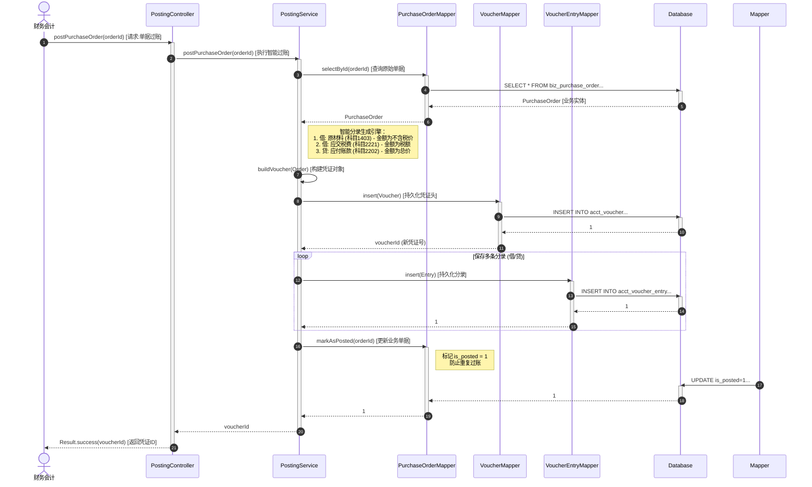
```mermaid
sequenceDiagram
    autonumber
    actor Accountant as 财务会计
    participant Ctrl as PostingController
    participant PostSvc as PostingService
    participant BizMapper as PurchaseOrderMapper
    participant VMapper as VoucherMapper
    participant EMapper as VoucherEntryMapper
    participant DB as Database

    Accountant->>Ctrl: postPurchaseOrder(orderId) [请求:单据过账]
    activate Ctrl
    Ctrl->>PostSvc: postPurchaseOrder(orderId) [执行智能过账]
    activate PostSvc

    %% 1. 获取源单据
    PostSvc->>BizMapper: selectById(orderId) [查询原始单据]
    activate BizMapper
    BizMapper->>DB: SELECT * FROM biz_purchase_order...
    activate DB
    DB-->>BizMapper: PurchaseOrder [业务实体]
    deactivate DB
    BizMapper-->>PostSvc: PurchaseOrder
    deactivate BizMapper

    %% 2. 核心逻辑：构建凭证
    note right of PostSvc: 智能分录生成引擎：<br/>1. 借: 原材料 (科目1403) - 金额为不含税价<br/>2. 借: 应交税费 (科目2221) - 金额为税额<br/>3. 贷: 应付账款 (科目2202) - 金额为总价
    PostSvc->>PostSvc: buildVoucher(Order) [构建凭证对象]
    
    %% 3. 事务保存
    PostSvc->>VMapper: insert(Voucher) [持久化凭证头]
    activate VMapper
    VMapper->>DB: INSERT INTO acct_voucher...
    activate DB
    DB-->>VMapper: 1
    deactivate DB
    VMapper-->>PostSvc: voucherId (新凭证号)
    deactivate VMapper

    loop 保存多条分录 (借/贷)
        PostSvc->>EMapper: insert(Entry) [持久化分录]
        activate EMapper
        EMapper->>DB: INSERT INTO acct_voucher_entry...
        activate DB
        DB-->>EMapper: 1
        deactivate DB
        EMapper-->>PostSvc: 1
        deactivate EMapper
    end

    %% 4. 回写状态
    PostSvc->>BizMapper: markAsPosted(orderId) [更新业务单据]
    activate BizMapper
    
    note right of BizMapper: 标记 is_posted = 1<br/>防止重复过账
    Mapper->>DB: UPDATE is_posted=1...
    activate DB
    DB-->>BizMapper: 1
    deactivate DB
    BizMapper-->>PostSvc: 1
    deactivate BizMapper

    PostSvc-->>Ctrl: voucherId
    deactivate PostSvc
    Ctrl-->>Accountant: Result.success(voucherId) [返回凭证ID]
    deactivate Ctrl
```

#### 5.3.2 凭证全生命周期管理 (UC-ACC-02)

场景：手工录入特殊凭证，系统强制校验“有借必有贷，借贷必相等”。

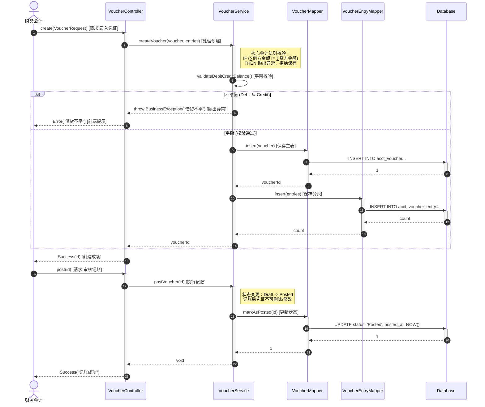
```mermaid
sequenceDiagram
    autonumber
    actor User as 财务会计
    participant Ctrl as VoucherController
    participant Svc as VoucherService
    participant VMapper as VoucherMapper
    participant EMapper as VoucherEntryMapper
    participant DB as Database

    %% --- 录入凭证 ---
    User->>Ctrl: create(VoucherRequest) [请求:录入凭证]
    activate Ctrl
    Ctrl->>Svc: createVoucher(voucher, entries) [处理创建]
    activate Svc
    
    note right of Svc: 核心会计法则校验：<br/>IF (∑借方金额 != ∑贷方金额)<br/>THEN 抛出异常，拒绝保存
    Svc->>Svc: validateDebitCreditBalance() [平衡校验]
    
    alt 不平衡 (Debit != Credit)
        Svc-->>Ctrl: throw BusinessException("借贷不平") [抛出异常]
        Ctrl-->>User: Error("借贷不平") [前端提示]
    else 平衡 (校验通过)
        Svc->>VMapper: insert(voucher) [保存主表]
        activate VMapper
        VMapper->>DB: INSERT INTO acct_voucher...
        activate DB
        DB-->>VMapper: 1
        deactivate DB
        VMapper-->>Svc: voucherId
        deactivate VMapper

        Svc->>EMapper: insert(entries) [保存分录]
        activate EMapper
        EMapper->>DB: INSERT INTO acct_voucher_entry...
        activate DB
        DB-->>EMapper: count
        deactivate DB
        EMapper-->>Svc: count
        deactivate EMapper

        Svc-->>Ctrl: voucherId
    end
    deactivate Svc
    Ctrl-->>User: Success(id) [创建成功]
    deactivate Ctrl

    %% --- 审核记账 ---
    User->>Ctrl: post(id) [请求:审核记账]
    activate Ctrl
    Ctrl->>Svc: postVoucher(id) [执行记账]
    activate Svc
    
    note right of Svc: 状态变更：Draft -> Posted<br/>记账后凭证不可删除/修改
    
    Svc->>VMapper: markAsPosted(id) [更新状态]
    activate VMapper
    VMapper->>DB: UPDATE status='Posted', posted_at=NOW()
    activate DB
    DB-->>VMapper: 1
    deactivate DB
    VMapper-->>Svc: 1
    deactivate VMapper
    Svc-->>Ctrl: void
    deactivate Svc
    Ctrl-->>User: Success("记账成功")
    deactivate Ctrl
```

#### 5.3.3 银行/现金自动对账 (UC-ACC-03)

场景：系统自动汇总账面余额，出纳仅需关注差异分析。

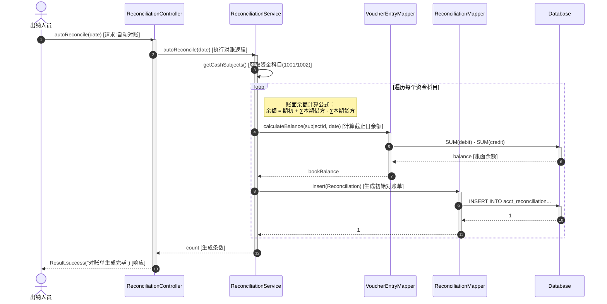
```mermaid
sequenceDiagram
    autonumber
    actor User as 出纳人员
    participant Ctrl as ReconciliationController
    participant Svc as ReconciliationService
    participant VMapper as VoucherEntryMapper
    participant RMapper as ReconciliationMapper
    participant DB as Database

    User->>Ctrl: autoReconcile(date) [请求:自动对账]
    activate Ctrl
    Ctrl->>Svc: autoReconcile(date) [执行对账逻辑]
    activate Svc

    Svc->>Svc: getCashSubjects() [获取资金科目(1001/1002)]
    
    loop 遍历每个资金科目
        note right of Svc: 账面余额计算公式：<br/>余额 = 期初 + ∑本期借方 - ∑本期贷方
        Svc->>VMapper: calculateBalance(subjectId, date) [计算截止日余额]
        activate VMapper
        VMapper->>DB: SUM(debit) - SUM(credit)
        activate DB
        DB-->>VMapper: balance [账面余额]
        deactivate DB
        VMapper-->>Svc: bookBalance
        deactivate VMapper

        Svc->>RMapper: insert(Reconciliation) [生成初始对账单]
        activate RMapper
        RMapper->>DB: INSERT INTO acct_reconciliation...
        activate DB
        DB-->>RMapper: 1
        deactivate DB
        RMapper-->>Svc: 1
        deactivate RMapper
    end

    Svc-->>Ctrl: count [生成条数]
    deactivate Svc
    Ctrl-->>User: Result.success("对账单生成完毕") [响应]
    deactivate Ctrl
```

#### 5.3.4 定期业务处理 (UC-ACC-04)

场景：期末一键执行自动折旧、损益结转，减少人工操作。

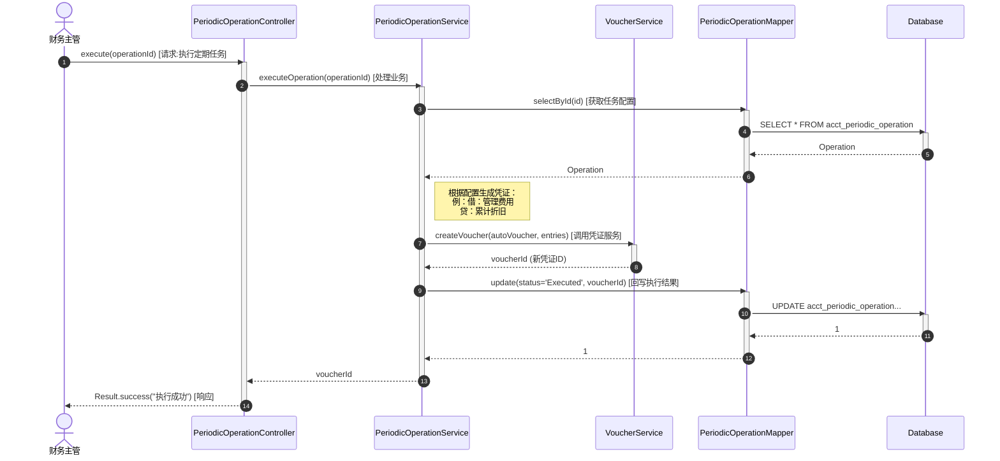
```mermaid
sequenceDiagram
    autonumber
    actor User as 财务主管
    participant Ctrl as PeriodicOperationController
    participant Svc as PeriodicOperationService
    participant VSvc as VoucherService
    participant Mapper as PeriodicOperationMapper
    participant DB as Database

    User->>Ctrl: execute(operationId) [请求:执行定期任务]
    activate Ctrl
    Ctrl->>Svc: executeOperation(operationId) [处理业务]
    activate Svc

    Svc->>Mapper: selectById(id) [获取任务配置]
    activate Mapper
    Mapper->>DB: SELECT * FROM acct_periodic_operation
    activate DB
    DB-->>Mapper: Operation
    deactivate DB
    Mapper-->>Svc: Operation
    deactivate Mapper

    note right of Svc: 根据配置生成凭证：<br/>例：借：管理费用<br/>贷：累计折旧
    Svc->>VSvc: createVoucher(autoVoucher, entries) [调用凭证服务]
    activate VSvc
    VSvc-->>Svc: voucherId (新凭证ID)
    deactivate VSvc

    %% 更新状态
    Svc->>Mapper: update(status='Executed', voucherId) [回写执行结果]
    activate Mapper
    Mapper->>DB: UPDATE acct_periodic_operation...
    activate DB
    DB-->>Mapper: 1
    deactivate DB
    Mapper-->>Svc: 1
    deactivate Mapper

    Svc-->>Ctrl: voucherId
    deactivate Svc
    Ctrl-->>User: Result.success("执行成功") [响应]
    deactivate Ctrl
```

#### 5.3.5 税务管理 (UC-ACC-05)

场景：系统自动计算税额，生成税单，用户确认申报。

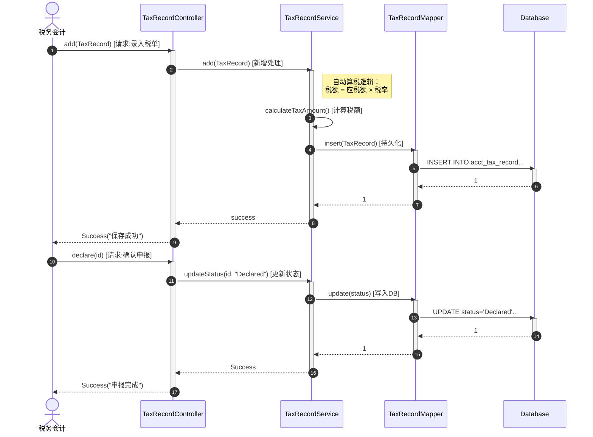
```mermaid
sequenceDiagram
    autonumber
    actor User as 税务会计
    participant Ctrl as TaxRecordController
    participant Svc as TaxRecordService
    participant Mapper as TaxRecordMapper
    participant DB as Database

    %% --- 新增税单 ---
    User->>Ctrl: add(TaxRecord) [请求:录入税单]
    activate Ctrl
    Ctrl->>Svc: add(TaxRecord) [新增处理]
    activate Svc
    
    note right of Svc: 自动算税逻辑：<br/>税额 = 应税额 × 税率
    Svc->>Svc: calculateTaxAmount() [计算税额]
    
    Svc->>Mapper: insert(TaxRecord) [持久化]
    activate Mapper
    Mapper->>DB: INSERT INTO acct_tax_record...
    activate DB
    DB-->>Mapper: 1
    deactivate DB
    Mapper-->>Svc: 1
    deactivate Mapper
    
    Svc-->>Ctrl: success
    deactivate Svc
    Ctrl-->>User: Success("保存成功")
    deactivate Ctrl

    %% --- 申报操作 ---
    User->>Ctrl: declare(id) [请求:确认申报]
    activate Ctrl
    Ctrl->>Svc: updateStatus(id, "Declared") [更新状态]
    activate Svc
    Svc->>Mapper: update(status) [写入DB]
    activate Mapper
    Mapper->>DB: UPDATE status='Declared'...
    activate DB
    DB-->>Mapper: 1
    deactivate DB
    Mapper-->>Svc: 1
    deactivate Mapper
    Svc-->>Ctrl: Success
    deactivate Svc
    Ctrl-->>User: Success("申报完成")
    deactivate Ctrl
```

### 5.4 财务报表模块

#### 5.4.1 资产负债表生成与导出 (UC-RPT-01)

场景：聚合资产、负债、权益类科目的余额，按会计准则生成报表结构。

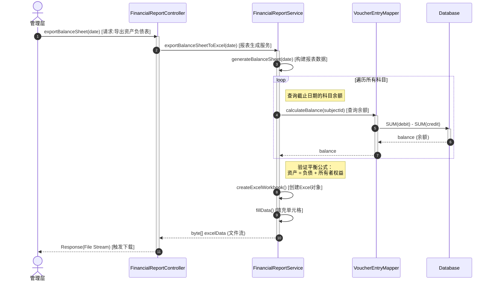
```mermaid
sequenceDiagram
    autonumber
    actor Manager as 管理层
    participant Ctrl as FinancialReportController
    participant Svc as FinancialReportService
    participant EntryMapper as VoucherEntryMapper
    participant DB as Database

    Manager->>Ctrl: exportBalanceSheet(date) [请求:导出资产负债表]
    activate Ctrl
    Ctrl->>Svc: exportBalanceSheetToExcel(date) [报表生成服务]
    activate Svc

    %% 数据准备
    Svc->>Svc: generateBalanceSheet(date) [构建报表数据]
    
    loop 遍历所有科目
        note right of Svc: 查询截止日期的科目余额
        Svc->>EntryMapper: calculateBalance(subjectId) [查询余额]
        activate EntryMapper
        EntryMapper->>DB: SUM(debit) - SUM(credit)
        activate DB
        DB-->>EntryMapper: balance (余额)
        deactivate DB
        EntryMapper-->>Svc: balance
        deactivate EntryMapper
    end

    note right of Svc: 验证平衡公式：<br/>资产 = 负债 + 所有者权益

    %% 文件生成
    Svc->>Svc: createExcelWorkbook() [创建Excel对象]
    Svc->>Svc: fillData() [填充单元格]
    
    Svc-->>Ctrl: byte[] excelData (文件流)
    deactivate Svc
    Ctrl-->>Manager: Response(File Stream) [触发下载]
    deactivate Ctrl
```

#### 5.4.2 利润表生成与导出 (UC-RPT-02)

场景：统计指定区间内损益类科目的发生额，计算净利润。

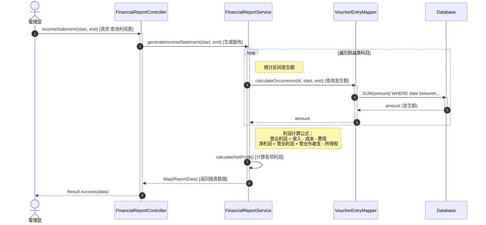
```mermaid
sequenceDiagram
    autonumber
    actor Manager as 管理层
    participant Ctrl as FinancialReportController
    participant Svc as FinancialReportService
    participant EntryMapper as VoucherEntryMapper
    participant DB as Database

    Manager->>Ctrl: incomeStatement(start, end) [请求:查询利润表]
    activate Ctrl
    Ctrl->>Svc: generateIncomeStatement(start, end) [生成服务]
    activate Svc

    loop 遍历损益类科目
        note right of Svc: 统计区间发生额
        Svc->>EntryMapper: calculateOccurrence(id, start, end) [查询发生额]
        activate EntryMapper
        EntryMapper->>DB: SUM(amount) WHERE date between...
        activate DB
        DB-->>EntryMapper: amount (发生额)
        deactivate DB
        EntryMapper-->>Svc: amount
        deactivate EntryMapper
    end

    note right of Svc: 利润计算公式：<br/>营业利润 = 收入 - 成本 - 费用<br/>净利润 = 营业利润 + 营业外收支 - 所得税
    Svc->>Svc: calculateNetProfit() [计算各项利润]
    
    Svc-->>Ctrl: Map(ReportData) [返回报表数据]
    deactivate Svc
    Ctrl-->>Manager: Result.success(data)
    deactivate Ctrl
```

#### 5.4.3 现金流量表生成与导出 (UC-RPT-03)

场景：基于凭证分录的现金流标记，分析资金流向。

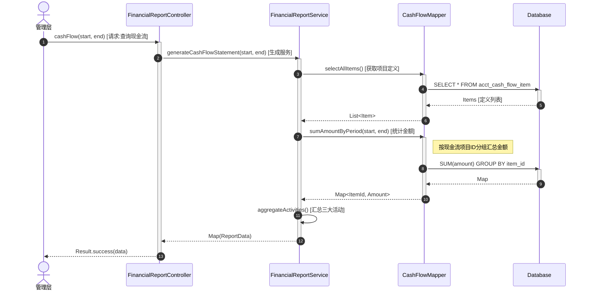
```mermaid
sequenceDiagram
    autonumber
    actor Manager as 管理层
    participant Ctrl as FinancialReportController
    participant Svc as FinancialReportService
    participant CFMapper as CashFlowMapper
    participant DB as Database

    Manager->>Ctrl: cashFlow(start, end) [请求:查询现金流]
    activate Ctrl
    Ctrl->>Svc: generateCashFlowStatement(start, end) [生成服务]
    activate Svc

    Svc->>CFMapper: selectAllItems() [获取项目定义]
    activate CFMapper
    CFMapper->>DB: SELECT * FROM acct_cash_flow_item
    activate DB
    DB-->>CFMapper: Items [定义列表]
    deactivate DB
    CFMapper-->>Svc: List<Item>
    deactivate CFMapper

    Svc->>CFMapper: sumAmountByPeriod(start, end) [统计金额]
    activate CFMapper
    note right of CFMapper: 按现金流项目ID分组汇总金额
    CFMapper->>DB: SUM(amount) GROUP BY item_id
    activate DB
    DB-->>CFMapper: Map
    deactivate DB
    CFMapper-->>Svc: Map<ItemId, Amount>
    deactivate CFMapper

    Svc->>Svc: aggregateActivities() [汇总三大活动]
    Svc-->>Ctrl: Map(ReportData)
    deactivate Svc
    Ctrl-->>Manager: Result.success(data)
    deactivate Ctrl
```


## 六、数据库设计 

本章节基于系统需求详细展示了 FS_System 的完整数据库结构。系统共包含 21 张数据表，按照功能域划分为：系统管理、基础档案、业务管理、会计核算 四大模块。

### 6.1 数据库设计规范

#### 6.1.1 设计策略

- 数据库选型：采用 MySQL 8.0，利用其成熟的事务处理能力（ACID）和 JSON 支持。
- 存储引擎：全库采用 InnoDB 引擎，确保支持行级锁和外键约束，适应高并发的业务场景。
- 字符集：统一使用 utf8mb4 字符集（排序规则 `utf8mb4_unicode_ci`），以全面支持多语言及特殊符号（如 Emoji）。
- 主键策略：所有表均使用 `bigint(20)` 类型的自增主键 (`AUTO_INCREMENT`)，确保索引效率。
- 字段设计：
  - 金额字段统一使用 `decimal(18, 2)`，杜绝浮点数精度丢失问题。
  - 状态字段使用 `enum` 或 `varchar`，明确业务流转状态。
  - 审计时间字段统一记录 `created_at` 和 `updated_at`，用于审计追踪。

#### 6.1.2 命名规范 

系统采用分层前缀命名法，将数据表划分为四个逻辑域，便于管理和维护，以下为示例：

| 前缀  | 含义   | 示例            | 描述                                     |
| --------- | ---------- | ------------------- | -------------------------------------------- |
| sys_  | 系统级配置 | `sys_company`       | 存放系统全局配置、日志、公司信息等           |
| base_ | 基础档案   | `base_customer`     | 存放相对静态的基础数据，如客户、供应商、员工 |
| biz_  | 核心业务   | `biz_sales_invoice` | 存放高频变动的业务单据，如订单、发票、报销单 |
| acct_ | 会计核算   | `acct_voucher`      | 存放财务核心数据，如凭证、科目、分录、账簿   |

#### 6.1.3 数据库结构图

以下 ER 图展示了系统核心实体及其关联关系。图中清晰表达了业务单据（Business）如何通过过账记录（Posting）转化为会计凭证（Accounting），以及基础档案（Base）的支撑作用。


```mermaid
erDiagram
    %% ==========================================
    %% 1. 系统管理模块 (System)
    %% ==========================================
    sys_company {
        bigint id PK "主键ID"
        varchar company_name "公司名称"
        varchar tax_number "纳税人识别号"
        varchar address "地址"
        varchar legal_representative "法人"
        decimal registered_capital "注册资本"
        int fiscal_year_start "会计年度起始月"
    }
    sys_config {
        bigint id PK "主键ID"
        varchar param_key "参数键(Unique)"
        varchar param_value "参数值"
        tinyint is_enabled "是否启用"
        varchar description "说明"
    }
    sys_operation_log {
        bigint id PK "主键ID"
        varchar operator "操作人"
        varchar operation_module "操作模块"
        varchar request_url "请求路径"
        varchar status "操作状态"
        datetime operation_time "操作时间"
    }

    %% ==========================================
    %% 2. 基础档案模块 (Base)
    %% ==========================================
    base_customer {
        bigint id PK "主键ID"
        varchar customer_code "客户编号(Unique)"
        varchar customer_name "客户名称"
        varchar tax_number "税号"
        decimal credit_limit "信用额度"
    }
    base_supplier {
        bigint id PK "主键ID"
        varchar supplier_code "供应商编号(Unique)"
        varchar supplier_name "供应商名称"
        varchar contact_person "联系人"
        varchar credit_level "信用等级"
    }
    base_employee {
        bigint id PK "主键ID"
        varchar employee_code "工号(Unique)"
        varchar employee_name "姓名"
        varchar department "部门"
        varchar position "职位"
    }

    %% ==========================================
    %% 3. 业务管理模块 (Business)
    %% ==========================================
    biz_sales_invoice {
        bigint id PK "主键ID"
        varchar invoice_no "发票号(Unique)"
        bigint customer_id FK "客户ID"
        date invoice_date "开票日期"
        decimal total_amount "销售总额"
        decimal tax_amount "税额"
        varchar status "状态(Draft/Posted...)"
    }
    biz_sales_invoice_item {
        bigint id PK "主键ID"
        bigint invoice_id FK "发票ID"
        varchar item_name "商品名称"
        decimal quantity "数量"
        decimal unit_price "单价"
        decimal amount "金额"
    }
    
    biz_purchase_order {
        bigint id PK "主键ID"
        varchar order_no "订单号(Unique)"
        bigint supplier_id FK "供应商ID"
        date order_date "订单日期"
        decimal total_amount "订单总额"
        varchar status "状态"
    }
    biz_purchase_order_item {
        bigint id PK "主键ID"
        bigint order_id FK "订单ID"
        varchar item_name "物品名称"
        decimal quantity "数量"
        decimal unit_price "单价"
        decimal amount "金额"
    }

    biz_expense_claim {
        bigint id PK "主键ID"
        varchar claim_no "报销单号"
        bigint employee_id FK "员工ID"
        date claim_date "报销日期"
        decimal total_amount "报销总额"
        varchar status "状态"
    }
    biz_expense_claim_item {
        bigint id PK "主键ID"
        bigint claim_id FK "报销单ID"
        varchar expense_type "费用类型"
        decimal amount "金额"
        varchar description "说明"
    }

    %% ==========================================
    %% 4. 会计核算模块 (Accounting)
    %% ==========================================
    acct_subject {
        bigint id PK "主键ID"
        varchar subject_code "科目编码(Unique)"
        varchar subject_name "科目名称"
        varchar subject_type "类型(Asset/Liability...)"
        bigint parent_id "父科目ID"
        tinyint is_leaf "是否叶子"
        varchar balance_direction "方向(Debit/Credit)"
    }
    acct_voucher {
        bigint id PK "主键ID"
        varchar voucher_no "凭证字号"
        date voucher_date "凭证日期"
        varchar voucher_type "凭证类型"
        varchar source_type "来源类型(多态)"
        bigint source_id "来源ID(多态)"
        decimal total_debit "借方合计"
        decimal total_credit "贷方合计"
        varchar status "状态"
    }
    acct_voucher_entry {
        bigint id PK "主键ID"
        bigint voucher_id FK "凭证ID"
        int line_number "行号"
        bigint subject_id FK "科目ID"
        decimal debit_amount "借方金额"
        decimal credit_amount "贷方金额"
        varchar abstract_text "摘要"
    }
    acct_posting_record {
        bigint id PK "主键ID"
        varchar source_type "来源类型"
        bigint source_id "来源ID"
        bigint voucher_id FK "凭证ID"
        decimal posted_amount "过账金额"
        datetime posted_at "过账时间"
    }
    acct_reconciliation {
        bigint id PK "主键ID"
        bigint subject_id FK "科目ID"
        date reconciliation_date "对账日期"
        decimal book_balance "账面余额"
        decimal bank_balance "实存/银行余额"
        decimal difference_amount "差异金额"
        varchar status "状态"
    }
    acct_tax_record {
        bigint id PK "主键ID"
        varchar tax_period "税期"
        varchar tax_type "税种"
        decimal taxable_amount "应税金额"
        decimal tax_rate "税率"
        decimal tax_amount "税额"
        varchar status "状态"
    }
    acct_periodic_operation {
        bigint id PK "主键ID"
        varchar operation_type "业务类型"
        varchar operation_period "期间"
        bigint voucher_id FK "生成的凭证ID"
        decimal amount "金额"
        varchar status "状态"
    }
    acct_cash_flow_item {
        bigint id PK "主键ID"
        varchar item_code "项目编码"
        varchar item_name "项目名称"
        varchar category "类别(经营/投资/筹资)"
        varchar direction "流向(流入/流出)"
    }
    acct_entry_cash_flow {
        bigint id PK "主键ID"
        bigint entry_id FK "分录ID"
        bigint cash_flow_item_id FK "现金流项目ID"
        decimal amount "金额"
    }

    %% ==========================================
    %% 关系定义 (Relationships)
    %% ==========================================
    
    %% 业务主从关系
    biz_sales_invoice ||--|{ biz_sales_invoice_item : "包含"
    biz_purchase_order ||--|{ biz_purchase_order_item : "包含"
    biz_expense_claim ||--|{ biz_expense_claim_item : "包含"

    %% 业务与基础档案关联
    base_customer ||--o{ biz_sales_invoice : "归属"
    base_supplier ||--o{ biz_purchase_order : "归属"
    base_employee ||--o{ biz_expense_claim : "申请"

    %% 会计核心关联
    acct_voucher ||--|{ acct_voucher_entry : "包含"
    acct_subject ||--o{ acct_voucher_entry : "引用"
    acct_subject ||--o{ acct_subject : "父子层级"
    
    %% 业务->财务过账关联 (通过PostingRecord连接)
    acct_voucher ||--o{ acct_posting_record : "生成"
    biz_sales_invoice |o..o| acct_posting_record : "来源(Sales)"
    biz_purchase_order |o..o| acct_posting_record : "来源(Purchase)"
    biz_expense_claim |o..o| acct_posting_record : "来源(Expense)"
    
    %% 其他财务关联
    acct_voucher ||--o{ acct_periodic_operation : "生成"
    acct_subject ||--o{ acct_reconciliation : "对账"
    
    %% 现金流量关联
    acct_voucher_entry ||--o{ acct_entry_cash_flow : "关联"
    acct_cash_flow_item ||--o{ acct_entry_cash_flow : "定义"
```

### 6.2 系统管理模块 (System Module)

该模块主要存储系统的全局配置与日志信息。

#### 6.2.1 公司信息表 (`sys_company`)

用于存储当前账套所属的企业主体信息，支持多公司扩展。

| 字段名           | 类型      | 必填 | 默认值 | 说明         |
| -------------------- | ------------- | -------- | ---------- | ---------------- |
| id               | BIGINT        | 是       | AUTO       | 主键ID       |
| company_name         | VARCHAR(200)  | 是       | -          | 公司名称         |
| tax_number           | VARCHAR(50)   | 是       | -          | 纳税人识别号     |
| address              | VARCHAR(200)  | 否       | -          | 公司地址         |
| legal_representative | VARCHAR(50)   | 否       | -          | 法人代表         |
| registered_capital   | DECIMAL(18,2) | 否       | 0.00       | 注册资本         |
| fiscal_year_start    | INT           | 否       | 1          | 会计年度起始月份 |
| created_at           | DATETIME      | 否       | NOW        | 创建时间         |

#### 6.2.2 系统操作日志表 (`sys_operation_log`)

记录关键操作日志，满足财务系统的审计与溯源需求。

| 字段名       | 类型     | 必填 | 默认值 | 说明     |
| ---------------- | ------------ | -------- | ---------- | ------------ |
| id           | BIGINT       | 是       | AUTO       | 主键ID   |
| operator         | VARCHAR(50)  | 是       | -          | 操作人用户名 |
| operation_module | VARCHAR(50)  | 是       | -          | 操作模块     |
| request_url      | VARCHAR(255) | 否       | -          | 请求路径     |
| ip_address       | VARCHAR(50)  | 否       | -          | 客户端IP     |
| status           | VARCHAR(20)  | 否       | Success    | 操作状态     |
| operation_time   | DATETIME     | 否       | NOW        | 操作时间     |

------

### 6.3 基础档案模块 (Base Module)

存储业务流转所需的基础静态数据。

#### 6.3.1 客户信息表 (`base_customer`)

| 字段名    | 类型      | 必填 | 默认值 | 说明          |
| ------------- | ------------- | -------- | ---------- | ----------------- |
| id        | BIGINT        | 是       | AUTO       | 主键ID        |
| customer_code | VARCHAR(50)   | 是       | -          | 客户编号 (Unique) |
| customer_name | VARCHAR(200)  | 是       | -          | 客户名称          |
| tax_number    | VARCHAR(50)   | 否       | -          | 税号              |
| credit_limit  | DECIMAL(18,2) | 否       | -          | 信用额度          |
| bank_account  | VARCHAR(50)   | 否       | -          | 银行账号          |

#### 6.3.2 供应商信息表 (`base_supplier`)

| 字段名     | 类型     | 必填 | 默认值 | 说明            |
| -------------- | ------------ | -------- | ---------- | ------------------- |
| id         | BIGINT       | 是       | AUTO       | 主键ID          |
| supplier_code  | VARCHAR(50)  | 是       | -          | 供应商编号 (Unique) |
| supplier_name  | VARCHAR(200) | 是       | -          | 供应商名称          |
| contact_person | VARCHAR(50)  | 否       | -          | 联系人              |
| credit_level   | VARCHAR(20)  | 否       | -          | 信用等级            |

#### 6.3.3 员工信息表 (`base_employee`)

| 字段名    | 类型    | 必填 | 默认值 | 说明      |
| ------------- | ----------- | -------- | ---------- | ------------- |
| id        | BIGINT      | 是       | AUTO       | 主键ID    |
| employee_code | VARCHAR(50) | 是       | -          | 工号 (Unique) |
| employee_name | VARCHAR(50) | 是       | -          | 姓名          |
| department    | VARCHAR(50) | 否       | -          | 所属部门      |
| position      | VARCHAR(50) | 否       | -          | 职位          |

------

### 6.4 业务管理模块 (Business Module)

采用主子表结构设计，存储各类业务单据。

#### 6.4.1 销售发票主表 (`biz_sales_invoice`)

| 字段名   | 类型      | 必填 | 默认值 | 说明                      |
| ------------ | ------------- | -------- | ---------- | ----------------------------- |
| id       | BIGINT        | 是       | AUTO       | 主键ID                    |
| invoice_no   | VARCHAR(50)   | 是       | -          | 发票单号 (Unique)             |
| customer_id  | BIGINT        | 是       | -          | 外键：关联客户表          |
| invoice_date | DATE          | 是       | -          | 开票日期                      |
| total_amount | DECIMAL(18,2) | 是       | 0.00       | 销售总额                      |
| tax_amount   | DECIMAL(18,2) | 是       | 0.00       | 税额                          |
| status       | VARCHAR(20)   | 是       | Draft      | 状态 (Draft/Confirmed/Posted) |

#### 6.4.2 销售发票明细表 (`biz_sales_invoice_item`)

| 字段名 | 类型      | 必填 | 默认值 | 说明               |
| ---------- | ------------- | -------- | ---------- | ---------------------- |
| id     | BIGINT        | 是       | AUTO       | 主键ID             |
| invoice_id | BIGINT        | 是       | -          | 外键：关联发票主表 |
| item_name  | VARCHAR(100)  | 是       | -          | 商品/服务名称          |
| quantity   | DECIMAL(18,2) | 是       | -          | 数量                   |
| unit_price | DECIMAL(18,2) | 是       | -          | 单价                   |
| amount     | DECIMAL(18,2) | 是       | -          | 行金额                 |
| tax_rate   | DECIMAL(5,2)  | 否       | 0.00       | 税率(%)                |

#### 6.4.3 采购订单主表 (`biz_purchase_order`)

| 字段名   | 类型      | 必填 | 默认值 | 说明               |
| ------------ | ------------- | -------- | ---------- | ---------------------- |
| id       | BIGINT        | 是       | AUTO       | 主键ID             |
| order_no     | VARCHAR(50)   | 是       | -          | 订单编号 (Unique)      |
| supplier_id  | BIGINT        | 是       | -          | 外键：关联供应商表 |
| order_date   | DATE          | 是       | -          | 订单日期               |
| total_amount | DECIMAL(18,2) | 是       | 0.00       | 订单总额               |
| status       | VARCHAR(20)   | 是       | Draft      | 状态                   |

#### 6.4.4 采购订单明细表 (`biz_purchase_order_item`)

| 字段名 | 类型      | 必填 | 默认值 | 说明               |
| ---------- | ------------- | -------- | ---------- | ---------------------- |
| id     | BIGINT        | 是       | AUTO       | 主键ID             |
| order_id   | BIGINT        | 是       | -          | 外键：关联订单主表 |
| item_name  | VARCHAR(100)  | 是       | -          | 物品名称               |
| quantity   | DECIMAL(18,2) | 是       | -          | 数量                   |
| amount     | DECIMAL(18,2) | 是       | -          | 行金额                 |

#### 6.4.5 费用报销主表 (`biz_expense_claim`)

| 字段名   | 类型      | 必填 | 默认值 | 说明                 |
| ------------ | ------------- | -------- | ---------- | ------------------------ |
| id       | BIGINT        | 是       | AUTO       | 主键ID               |
| claim_no     | VARCHAR(50)   | 是       | -          | 报销单号                 |
| employee_id  | BIGINT        | 是       | -          | 外键：关联员工表     |
| claim_date   | DATE          | 是       | -          | 报销日期                 |
| total_amount | DECIMAL(18,2) | 是       | 0.00       | 报销总额                 |
| status       | VARCHAR(20)   | 是       | Draft      | 状态 (Approved/Rejected) |

#### 6.4.6 费用报销明细表 (`biz_expense_claim_item`)

| 字段名   | 类型      | 必填 | 默认值 | 说明               |
| ------------ | ------------- | -------- | ---------- | ---------------------- |
| id       | BIGINT        | 是       | AUTO       | 主键ID             |
| claim_id     | BIGINT        | 是       | -          | 外键：关联报销主表 |
| expense_type | VARCHAR(50)   | 是       | -          | 费用类型               |
| amount       | DECIMAL(18,2) | 是       | -          | 金额                   |
| description  | VARCHAR(255)  | 否       | -          | 费用说明               |

------

### 6.5 会计核算模块 (Accounting Module)

该模块是系统的核心，包含科目、凭证、账簿及报表相关表结构。

#### 6.5.1 会计科目表 (`acct_subject`)

存储国家标准的会计科目体系。

| 字段名        | 类型     | 必填 | 默认值 | 说明                   |
| ----------------- | ------------ | -------- | ---------- | -------------------------- |
| id            | BIGINT       | 是       | AUTO       | 主键ID                 |
| subject_code      | VARCHAR(50)  | 是       | -          | 科目编码 (Unique, 如1001)  |
| subject_name      | VARCHAR(200) | 是       | -          | 科目名称                   |
| subject_type      | VARCHAR(20)  | 是       | -          | 类型 (Asset/Liability/...) |
| parent_id         | BIGINT       | 否       | 0          | 父科目ID (0为顶级)         |
| level             | INT          | 否       | 1          | 层级                       |
| is_leaf           | TINYINT(1)   | 否       | 1          | 是否叶子节点               |
| balance_direction | VARCHAR(10)  | 是       | Debit      | 余额方向 (Debit/Credit)    |

#### 6.5.2 会计凭证主表 (`acct_voucher`)

存储凭证头信息。

| 字段名   | 类型      | 必填 | 默认值 | 说明                     |
| ------------ | ------------- | -------- | ---------- | ---------------------------- |
| id       | BIGINT        | 是       | AUTO       | 主键ID                   |
| voucher_no   | VARCHAR(50)   | 是       | -          | 凭证字号 (如 JZ-2025-001)    |
| voucher_date | DATE          | 是       | -          | 凭证日期                     |
| voucher_type | VARCHAR(20)   | 是       | Manual     | 凭证类型                     |
| source_type  | VARCHAR(20)   | 否       | -          | 来源类型 (Purchase/Sales...) |
| source_id    | BIGINT        | 否       | -          | 来源单据ID (多态关联)        |
| total_debit  | DECIMAL(18,2) | 是       | 0.00       | 借方合计                     |
| total_credit | DECIMAL(18,2) | 是       | 0.00       | 贷方合计                     |
| status       | VARCHAR(20)   | 是       | Draft      | 状态 (Draft/Posted)          |

#### 6.5.3 凭证分录表 (`acct_voucher_entry`)

存储凭证的具体借贷分录。

| 字段名    | 类型      | 必填 | 默认值 | 说明               |
| ------------- | ------------- | -------- | ---------- | ---------------------- |
| id        | BIGINT        | 是       | AUTO       | 主键ID             |
| voucher_id    | BIGINT        | 是       | -          | 外键：关联凭证主表 |
| line_number   | INT           | 是       | -          | 分录行号               |
| subject_id    | BIGINT        | 是       | -          | 外键：关联科目表   |
| abstract_text | VARCHAR(500)  | 否       | -          | 摘要                   |
| debit_amount  | DECIMAL(18,2) | 是       | 0.00       | 借方金额               |
| credit_amount | DECIMAL(18,2) | 是       | 0.00       | 贷方金额               |

#### 6.5.4 现金流量项目表 (`acct_cash_flow_item`)

定义现金流量表的基础项目结构。

| 字段名 | 类型     | 必填 | 默认值 | 说明               |
| ---------- | ------------ | -------- | ---------- | ---------------------- |
| id     | BIGINT       | 是       | AUTO       | 主键ID             |
| item_code  | VARCHAR(50)  | 是       | -          | 项目编码 (如 CF_OP_01) |
| item_name  | VARCHAR(200) | 是       | -          | 项目名称               |
| category   | VARCHAR(20)  | 是       | -          | 类别 (经营/投资/筹资)  |
| direction  | VARCHAR(10)  | 是       | -          | 流向 (流入/流出)       |

#### 6.5.5 凭证-现金流映射表 (`acct_entry_cash_flow`)

关联表，用于标记某条分录属于哪个现金流量项目。

| 字段名        | 类型      | 必填 | 默认值 | 说明                   |
| ----------------- | ------------- | -------- | ---------- | -------------------------- |
| id            | BIGINT        | 是       | AUTO       | 主键ID                 |
| entry_id          | BIGINT        | 是       | -          | 外键：关联凭证分录表   |
| cash_flow_item_id | BIGINT        | 是       | -          | 外键：关联现金流量项目 |
| amount            | DECIMAL(18,2) | 是       | -          | 关联金额                   |

#### 6.5.6 过账记录表 (`acct_posting_record`)

连接业务单据与会计凭证的中间表，实现审计追踪。

| 字段名    | 类型      | 必填 | 默认值 | 说明               |
| ------------- | ------------- | -------- | ---------- | ---------------------- |
| id        | BIGINT        | 是       | AUTO       | 主键ID             |
| source_type   | VARCHAR(20)   | 是       | -          | 来源类型 (枚举)        |
| source_id     | BIGINT        | 是       | -          | 来源单据ID             |
| voucher_id    | BIGINT        | 是       | -          | 外键：生成的凭证ID |
| posted_amount | DECIMAL(18,2) | 是       | -          | 过账金额               |
| posted_at     | DATETIME      | 否       | NOW        | 过账时间               |
| posted_by     | VARCHAR(50)   | 否       | -          | 操作人                 |

#### 6.5.7 账实核对记录表 (`acct_reconciliation`)

记录银行对账或现金盘点结果。

| 字段名          | 类型      | 必填 | 默认值 | 说明                       |
| ------------------- | ------------- | -------- | ---------- | ------------------------------ |
| id              | BIGINT        | 是       | AUTO       | 主键ID                     |
| subject_id          | BIGINT        | 是       | -          | 外键：对账科目(如银行存款) |
| reconciliation_date | DATE          | 是       | -          | 对账日期                       |
| book_balance        | DECIMAL(18,2) | 是       | 0.00       | 系统账面余额                   |
| bank_balance        | DECIMAL(18,2) | 是       | 0.00       | 实际/银行余额                  |
| difference_amount   | DECIMAL(18,2) | 否       | 0.00       | 差异金额                       |
| status              | VARCHAR(20)   | 否       | Pending    | 对账状态                       |

#### 6.5.8 税务记录表 (`acct_tax_record`)

记录税费的计提与缴纳情况。

| 字段名     | 类型      | 必填 | 默认值 | 说明             |
| -------------- | ------------- | -------- | ---------- | -------------------- |
| id         | BIGINT        | 是       | AUTO       | 主键ID           |
| tax_period     | VARCHAR(20)   | 是       | -          | 税期 (yyyy-MM)       |
| tax_type       | VARCHAR(50)   | 是       | -          | 税种                 |
| taxable_amount | DECIMAL(18,2) | 是       | 0.00       | 应税金额             |
| tax_amount     | DECIMAL(18,2) | 是       | 0.00       | 税额                 |
| status         | VARCHAR(20)   | 是       | Pending    | 状态 (Declared/Paid) |

#### 6.5.9 定期业务表 (`acct_periodic_operation`)

记录自动生成的定期业务（如折旧、结转）。

| 字段名       | 类型      | 必填 | 默认值 | 说明               |
| ---------------- | ------------- | -------- | ---------- | ---------------------- |
| id           | BIGINT        | 是       | AUTO       | 主键ID             |
| operation_type   | VARCHAR(50)   | 是       | -          | 业务类型 (如计提折旧)  |
| operation_period | VARCHAR(20)   | 是       | -          | 期间 (yyyy-MM)         |
| voucher_id       | BIGINT        | 否       | -          | 外键：生成的凭证ID |
| amount           | DECIMAL(18,2) | 是       | 0.00       | 金额                   |
| status           | VARCHAR(20)   | 否       | Pending    | 执行状态               |


## 七、主界面设计

本章节基于系统前端工程（Vue 3 + Element Plus + Vite），详细阐述了系统的界面布局、交互逻辑及视觉设计。设计严格遵循系统菜单结构，从基础配置到业务发生，再到财务核算与报表分析，形成完整的业务闭环。

### 7.1 总体布局

系统采用标准的 Admin 布局，确保操作的一致性与稳定性。

- 侧边导航栏 (`Layout/Aside`)：
  - 结构：完全对应路由配置，支持多级嵌套（如“基础设置”下包含“企业初始化”等子菜单）。
  - 交互：菜单具备路由跟随功能，刷新页面后侧边栏高亮项自动同步当前 URL。
- 顶部状态栏 (`Layout/Header`)：
  - 功能：集成面包屑导航（显示当前层级）、全屏切换及用户账户操作（个人中心/退出）。
- 主体内容区 (`Layout/Main`)：
  - 设计：所有功能页面均内嵌于 `el-card` 容器中，保持统一的“白底阴影”卡片风格，通过 `router-view` 进行视图切换。

### 7.2 工作台 (Dashboard)

界面功能：

作为系统的入口，提供核心数据监控与快捷导航。

操作与交互：

1. 数据概览：顶部展示 4 个关键指标卡片（核心业务数据）。
   - *交互*：点击卡片（如“待审核单据”），系统通过 `router.push` 跳转至对应业务列表，并携带状态参数（`status=Draft`），实现数据穿透。
2. 流程引导：中部通过可视化流程图展示财务作业链路。
   - *交互*：点击流程节点（如“智能过账”图标），直接跳转至相应功能模块。
3. 技术与版本：底部展示当前系统的技术栈信息（Spring Boot + Vue3）及版本号。

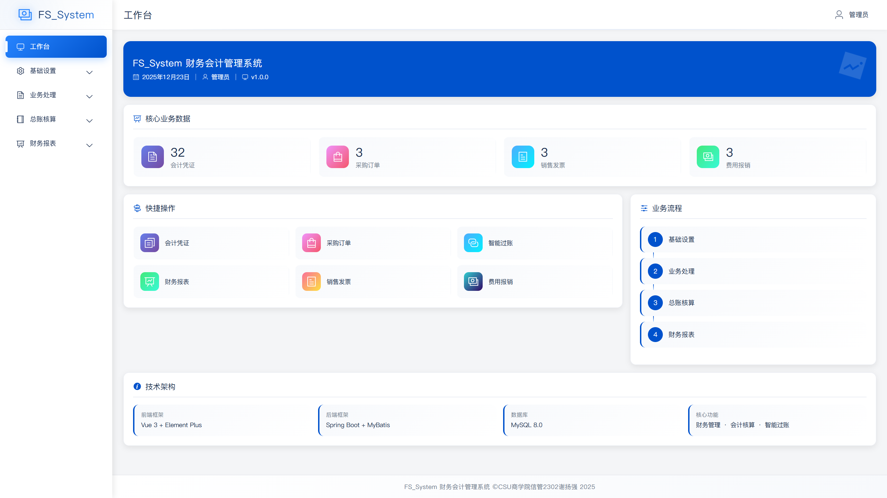

### 7.3 基础设置 (System Settings)

本模块负责初始化系统运行所需的静态数据。

#### 7.3.1 企业初始化 (`Company.vue`)

界面功能：维护当前账套的主体信息，用于报表抬头及发票打印。

操作流程：

- 查看：页面加载时自动调用 `getCompanyInfo` 回显数据。
- 编辑：修改注册资本、税号等信息，前端使用 `el-form` 进行格式校验（如金额必须为数字），点击“保存”提交更新。

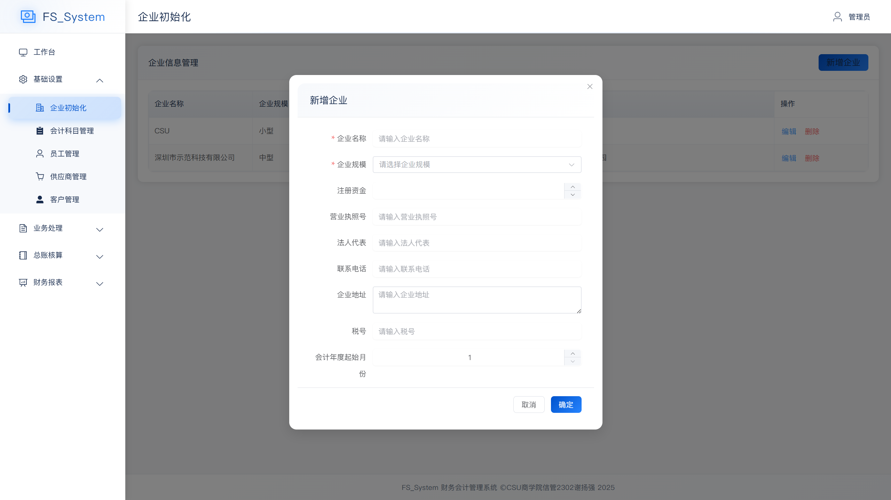

#### 7.3.2 会计科目管理 (`AccountSubject.vue`)

界面功能：构建企业的财务核算底层体系。

实现细节：

- 树形展示：使用 `el-table` 的 `row-key="id"` 属性，将平铺的科目列表渲染为可折叠的树状结构（一级科目 $\rightarrow$ 明细科目）。
- 类型筛选：顶部通过 `el-tabs` 切换（资产/负债/权益/成本/损益），前端根据 `subjectType` 字段过滤表格数据。
- 新增校验：新增子科目时，前端自动带出父级科目的借贷方向。

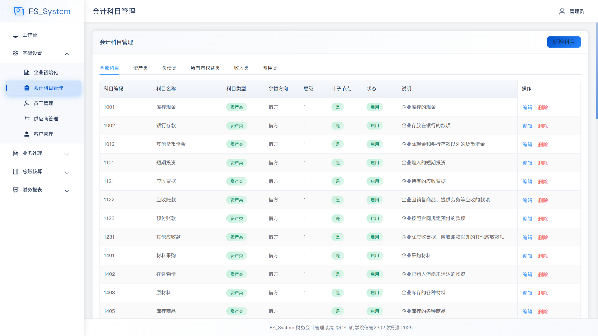

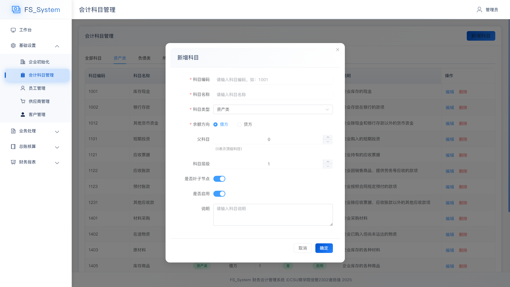

#### 7.3.3 员工管理 (`Employee.vue`)

界面功能：维护企业人员档案，用于报销与工资核算。

操作流程：

- 新增：弹出对话框，录入工号、姓名、部门。工号字段绑定 `blur` 事件，失焦时自动请求后端校验唯一性。
- 状态控制：支持对离职员工进行“停用”操作，停用后的员工在报销单中不可被选择。

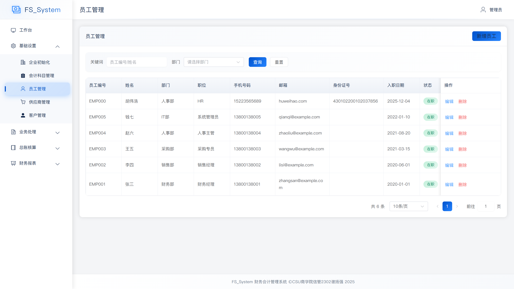

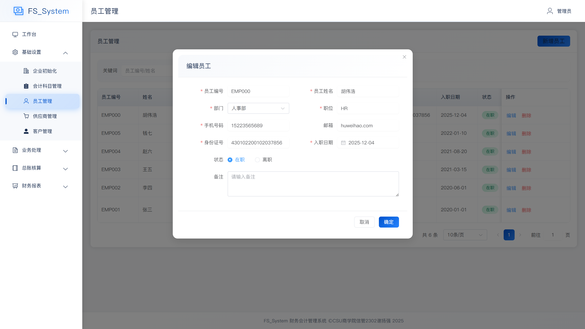

#### 7.3.4 供应商管理 (`Supplier.vue`)

界面功能：采购业务的往来单位管理。

设计亮点：

- 信息聚合：列表页重点展示“信用等级”与“联系方式”，便于采购人员快速决策。


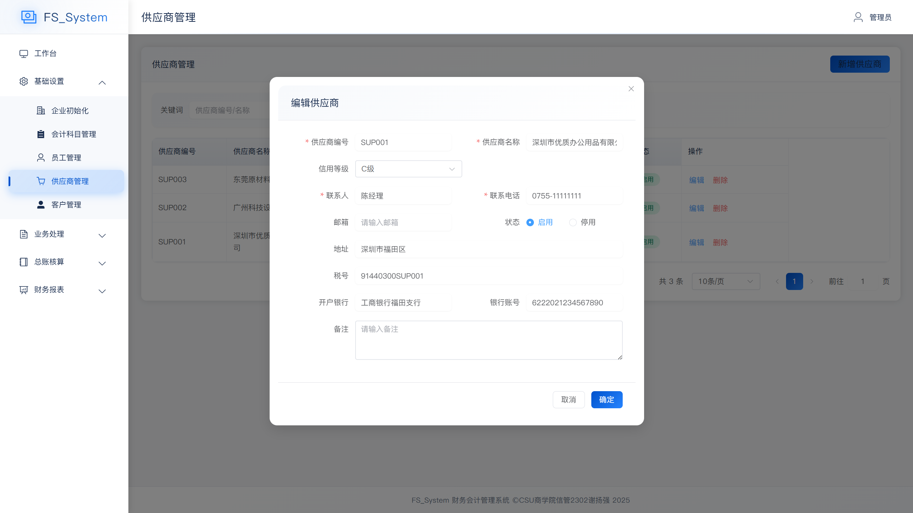

#### 7.3.5 客户管理 (`Customer.vue`)

界面功能：销售业务的往来单位管理。

设计亮点：

- 信用管控：录入“信用额度”，该字段后续将用于销售单据的超限预警。

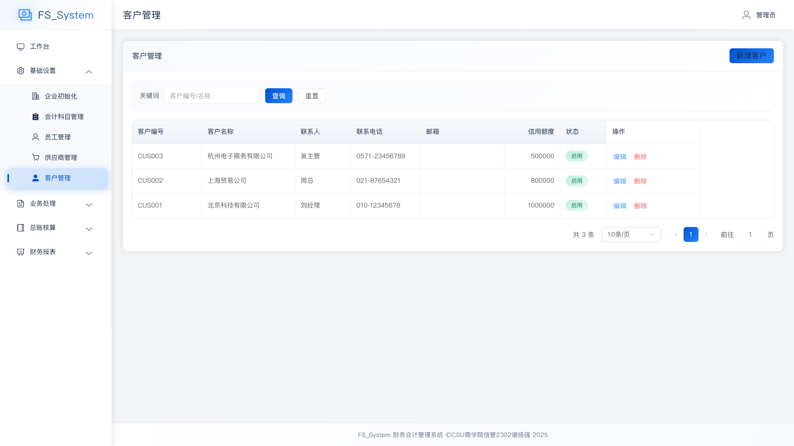

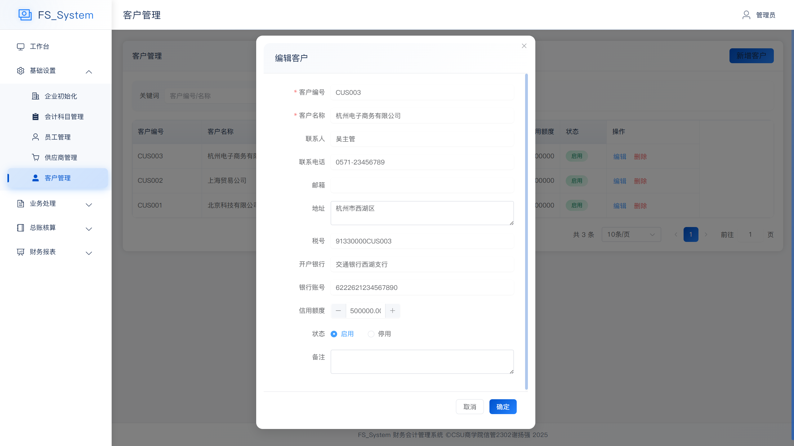

### 7.4 业务管理 (Business Management)

本模块处理日常经济业务，强调主子表单录入与状态流转。

#### 7.4.1 销售发票 (`SalesInvoice.vue`)

界面功能：录入向客户开具的销售单据。

交互逻辑：

- 动态明细：弹窗表单支持动态 `push` 商品行。
- 即时计算：利用 Vue 的 `watch` 监听器，当用户修改“数量”或“单价”时，自动更新“行金额”及表单底部的“总金额”和“税额”。
- 状态变更：点击“确认”，单据状态由 `Draft` 变更为 `Confirmed`，并锁定编辑功能。

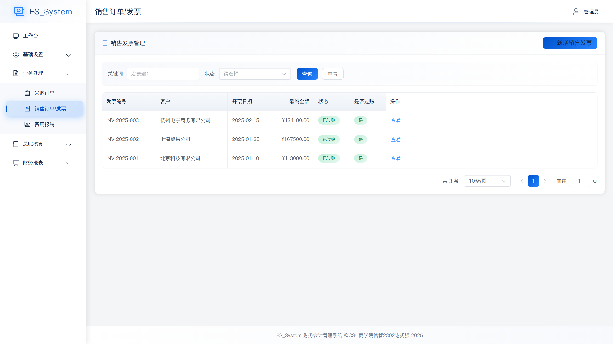


#### 7.4.2 采购订单 (`PurchaseOrder.vue`)

界面功能：录入企业采购需求。

操作流程：

- 录入：选择供应商（下拉搜索），添加采购物资明细。
- 控制：列表页根据 `isPosted` 字段判断：若已过账，则隐藏“编辑/删除”按钮，显示“已过账”绿色标签，防止财务数据被篡改。

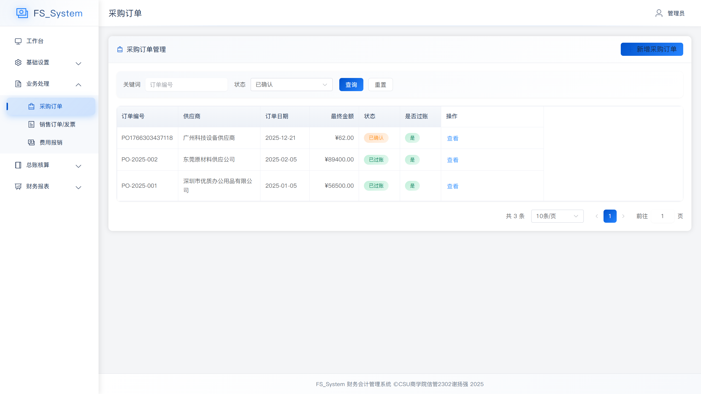

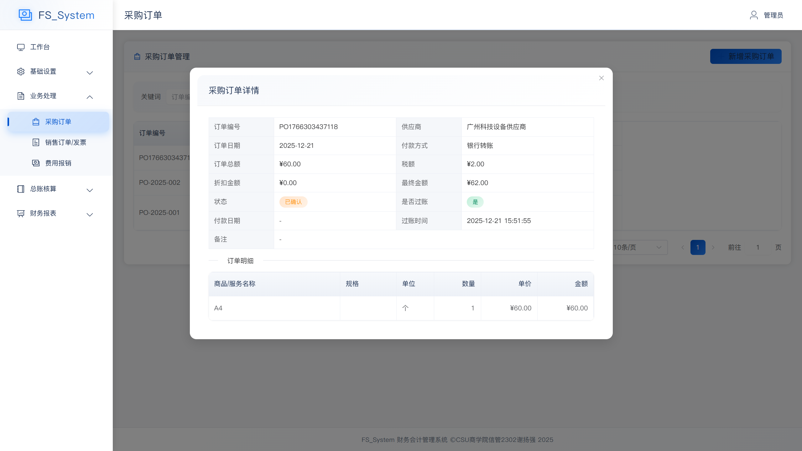

#### 7.4.3 费用报销 (`ExpenseClaim.vue`)

界面功能：全员报销申请与审批。

交互逻辑：

- 多角色视图：
  - 申请人：操作“提交”，状态变更为 `Submitted`。
  - 审批人：看到待办列表，操作“通过”或“驳回”。驳回时通过 `ElMessageBox.prompt` 强制要求输入拒绝理由。

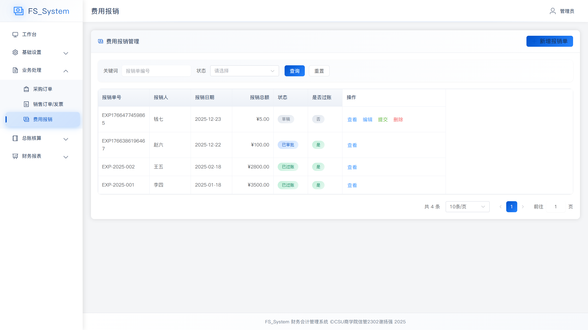

### 7.5 会计核算 (Accounting Core)

本模块是系统的核心，负责将业务数据转化为财务凭证。

#### 7.5.1 凭证管理 (`Voucher.vue`)

界面功能：手工录入与查询会计凭证。

实现细节：

- 拟真设计：表单布局模仿真实纸质凭证（摘要栏、科目栏、借贷金额栏）。
- 平衡强校验：前端实时计算 `∑借方` 与 `∑贷方`。若两者不等，底部合计行显示红色警告，并禁用保存按钮，强制保证借贷平衡。
- 科目联想：科目输入框支持输入代码（如 '1001'）自动匹配科目名称。

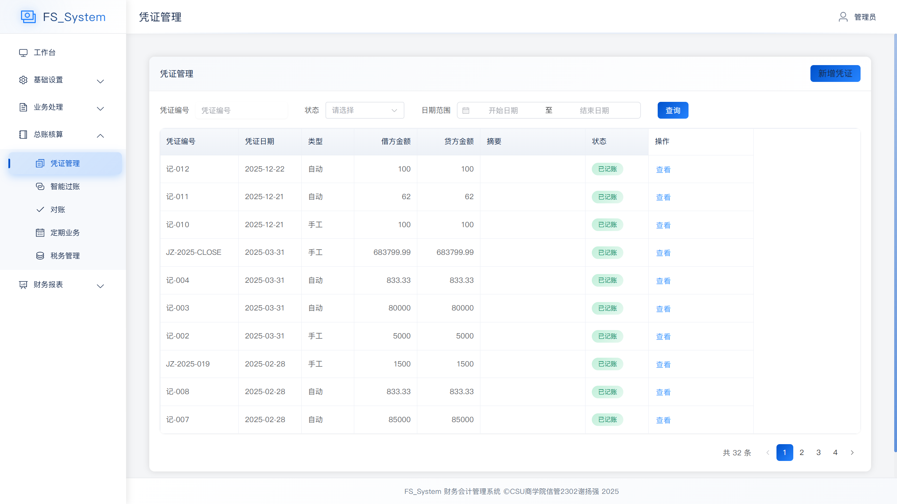

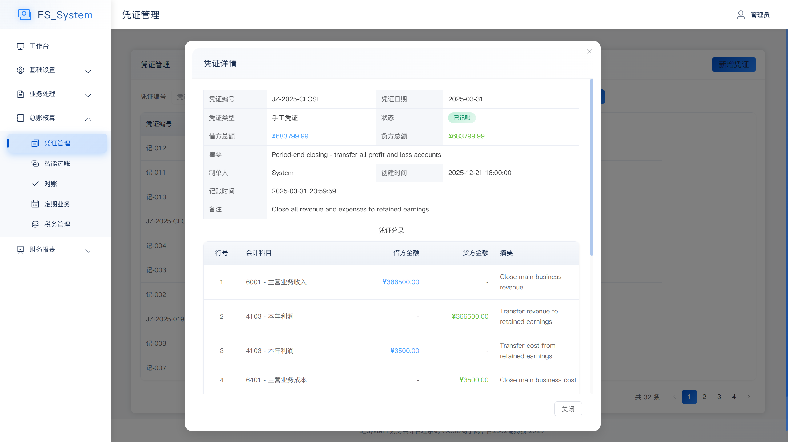

#### 7.5.2 智能过账 (`Posting.vue`)

界面功能：业务单据批量转凭证的枢纽。

操作流程：

- 分类处理：通过 `el-tabs` 将待处理单据分为“采购”、“销售”、“报销”三个页签。
- 批量过账：用户勾选多条记录 $\rightarrow$ 点击“批量过账” $\rightarrow$ 后端生成凭证 $\rightarrow$ 前端提示“成功生成 X 张凭证”并刷新列表。

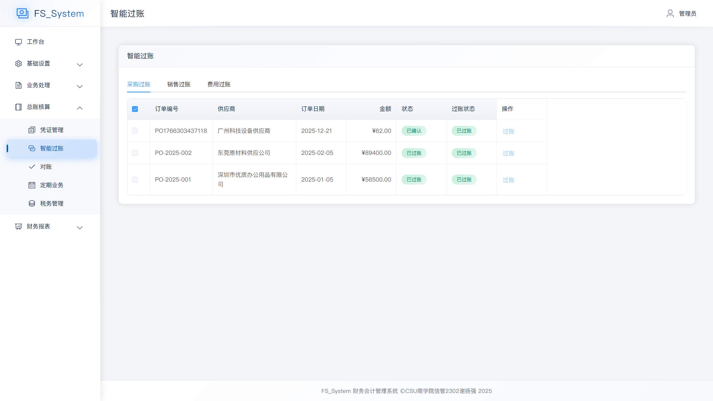

#### 7.5.3 对账 (`Reconciliation.vue`)

界面功能：出纳进行账实核对。

交互逻辑：

- 一键对账：点击按钮，系统调用后端接口拉取指定月份的科目余额。
- 差异高亮：前端计算 `差异 = 账面余额 - 实存余额`。若有差异，差异金额列标红显示，直观提示风险。

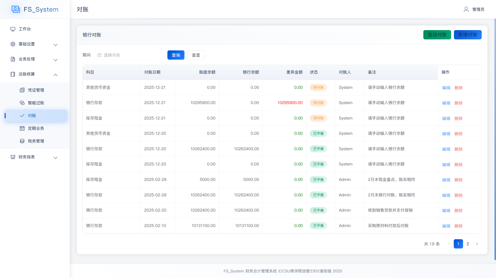

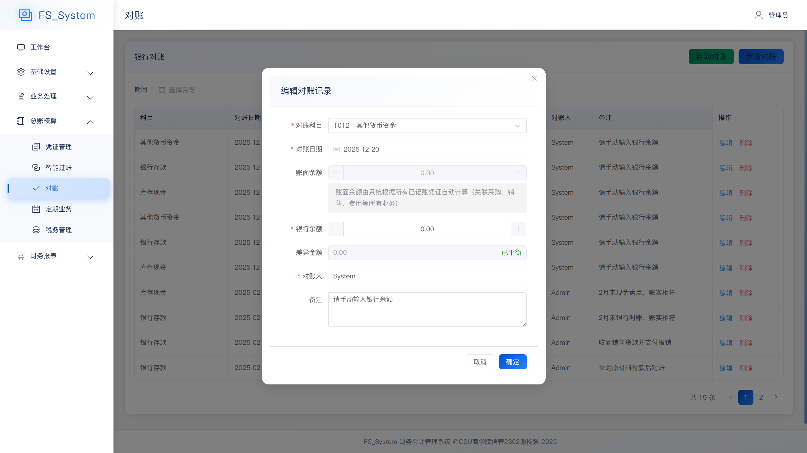

#### 7.5.4 定期业务 (`PeriodicOperation.vue`)

界面功能：处理期末结转、折旧计提等自动化任务。

操作：列表展示本期需执行的任务，点击“执行”后，状态由 Pending 更新为 Executed，并回显生成的凭证号连接。

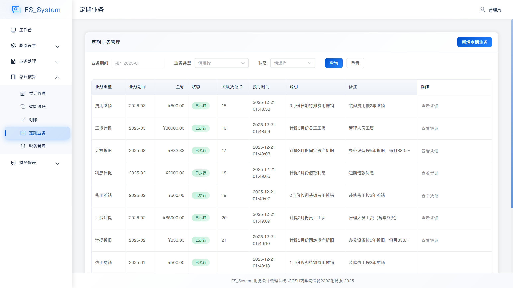

#### 7.5.5 税务管理 (`TaxRecord.vue`)

界面功能：税金计算与申报。

操作流程：新增税单 $\rightarrow$ 系统自动算税 $\rightarrow$ 点击“申报”（锁定） $\rightarrow$ 点击“缴纳”（记录时间）。

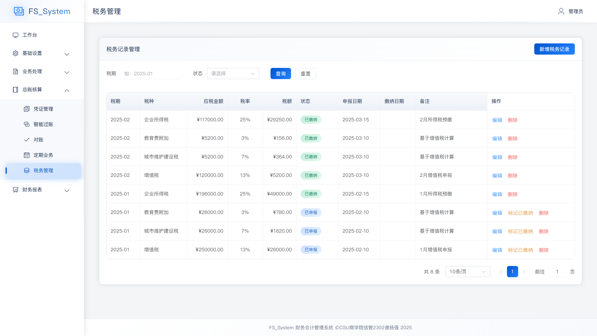

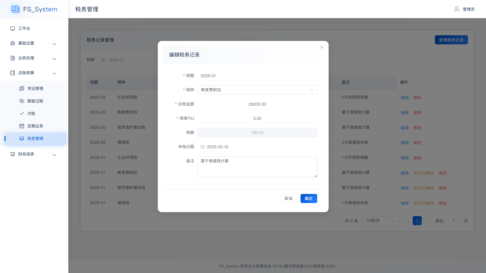

### 7.6 财务报表 (Financial Reports)

本模块提供最终的财务数据产出，支持查询与导出。

#### 7.6.1 资产负债表 (`BalanceSheet.vue`)

界面功能：反映特定日期的财务状况。

布局设计：采用左右账户式布局（el-row 分两列），左侧渲染资产，右侧渲染负债及权益。右上角实时显示“平衡”状态标签。

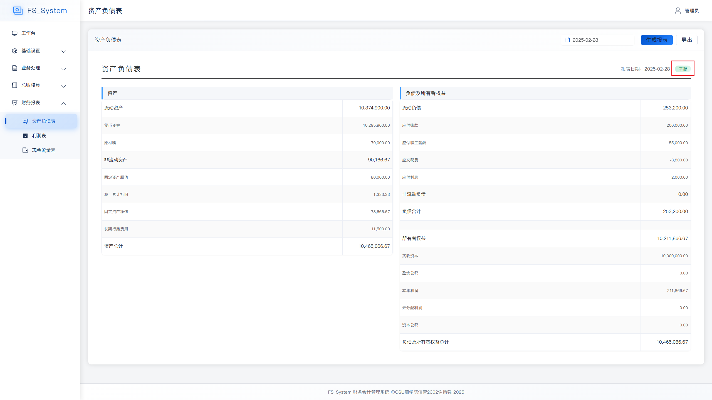

#### 7.6.2 利润表 (`IncomeStatement.vue`)

界面功能：反映一定时期的经营成果。

布局设计：采用多步式结构，通过表格缩进体现“营业收入 $\rightarrow$ 营业利润 $\rightarrow$ 净利润”的计算层级。

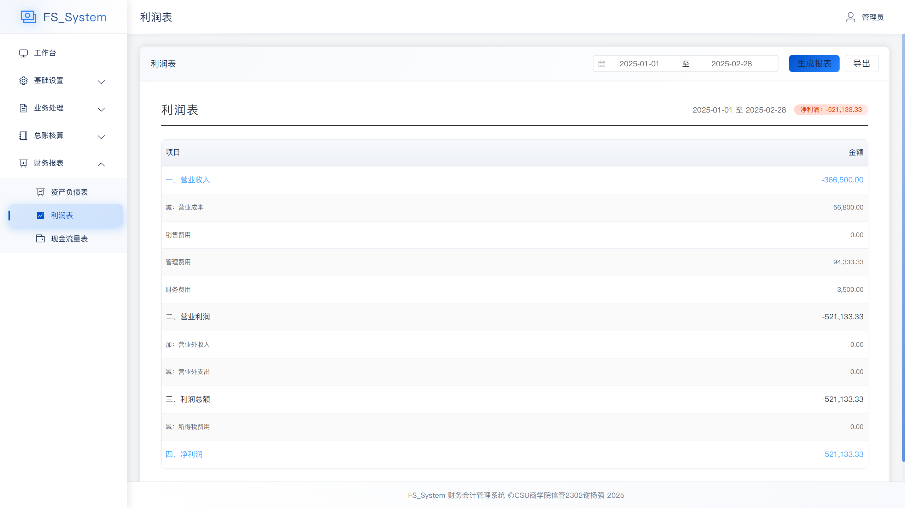

#### 7.6.3 现金流量表 (`CashFlow.vue`)

界面功能：反映现金的流入流出。

布局设计：数据按“经营”、“投资”、“筹资”三大活动分类展示，净额小于 0 时字体自动变红。

导出交互：所有报表页均提供“导出 Excel”按钮，前端接收文件流并触发浏览器下载。

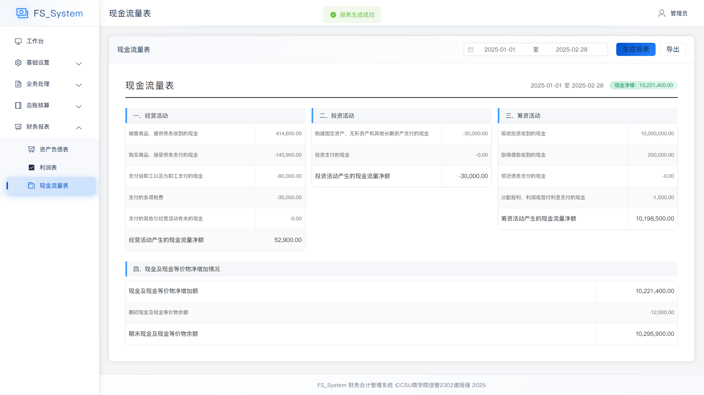


## 八、附录

### 8.1 文件结构

#### 8.1.1 后端项目结构

```
backend/
├── src/
│   ├── main/
│   │   ├── java/com/fs/system/
│   │   │   ├── FsSystemApplication.java      # 启动类
│   │   │   ├── common/                        # 公共类
│   │   │   │   ├── BaseEntity.java           # 实体基类
│   │   │   │   ├── PageResult.java           # 分页结果
│   │   │   │   └── Result.java               # 统一响应
│   │   │   ├── config/                        # 配置类
│   │   │   │   └── CorsConfig.java           # 跨域配置
│   │   │   ├── controller/                    # 控制器层
│   │   │   │   ├── AccountSubjectController.java    # 科目管理
│   │   │   │   ├── CompanyController.java           # 公司管理
│   │   │   │   ├── EmployeeController.java          # 员工管理
│   │   │   │   ├── CustomerController.java          # 客户管理
│   │   │   │   ├── SupplierController.java          # 供应商管理
│   │   │   │   ├── SalesInvoiceController.java      # 销售发票
│   │   │   │   ├── PurchaseOrderController.java     # 采购订单
│   │   │   │   ├── ExpenseClaimController.java      # 报销单
│   │   │   │   ├── VoucherController.java           # 凭证管理
│   │   │   │   ├── PostingController.java           # 过账处理
│   │   │   │   ├── ReconciliationController.java    # 对账管理
│   │   │   │   ├── TaxRecordController.java         # 税务记录
│   │   │   │   ├── PeriodicOperationController.java # 期间操作
│   │   │   │   └── ReportController.java            # 报表生成
│   │   │   ├── entity/                        # 实体类
│   │   │   │   ├── AccountSubject.java       # 会计科目
│   │   │   │   ├── Company.java              # 公司
│   │   │   │   ├── Employee.java             # 员工
│   │   │   │   ├── Customer.java             # 客户
│   │   │   │   ├── Supplier.java             # 供应商
│   │   │   │   ├── SalesInvoice.java         # 销售发票
│   │   │   │   ├── SalesInvoiceItem.java     # 销售明细
│   │   │   │   ├── PurchaseOrder.java        # 采购订单
│   │   │   │   ├── PurchaseOrderItem.java    # 采购明细
│   │   │   │   ├── ExpenseClaim.java         # 报销单
│   │   │   │   ├── ExpenseClaimItem.java     # 报销明细
│   │   │   │   ├── Voucher.java              # 会计凭证
│   │   │   │   ├── VoucherEntry.java         # 凭证分录
│   │   │   │   ├── CashFlowItem.java         # 现金流量项目
│   │   │   │   ├── PostingRecord.java        # 过账记录
│   │   │   │   ├── Reconciliation.java       # 对账记录
│   │   │   │   ├── TaxRecord.java            # 税务记录
│   │   │   │   └── PeriodicOperation.java    # 期间操作
│   │   │   ├── exception/                     # 异常处理
│   │   │   │   ├── BusinessException.java    # 业务异常
│   │   │   │   └── GlobalExceptionHandler.java # 全局异常处理
│   │   │   ├── mapper/                        # 数据访问层
│   │   │   │   ├── AccountSubjectMapper.java
│   │   │   │   ├── CompanyMapper.java
│   │   │   │   ├── EmployeeMapper.java
│   │   │   │   ├── CustomerMapper.java
│   │   │   │   ├── SupplierMapper.java
│   │   │   │   ├── SalesInvoiceMapper.java
│   │   │   │   ├── PurchaseOrderMapper.java
│   │   │   │   ├── ExpenseClaimMapper.java
│   │   │   │   ├── VoucherMapper.java
│   │   │   │   ├── VoucherEntryMapper.java
│   │   │   │   ├── PostingRecordMapper.java
│   │   │   │   ├── ReconciliationMapper.java
│   │   │   │   └── TaxRecordMapper.java
│   │   │   └── service/                       # 业务逻辑层
│   │   │       ├── AccountSubjectService.java
│   │   │       ├── CompanyService.java
│   │   │       ├── EmployeeService.java
│   │   │       ├── CustomerService.java
│   │   │       ├── SupplierService.java
│   │   │       ├── SalesInvoiceService.java
│   │   │       ├── PurchaseOrderService.java
│   │   │       ├── ExpenseClaimService.java
│   │   │       ├── VoucherService.java
│   │   │       ├── PostingService.java
│   │   │       ├── ReconciliationService.java
│   │   │       ├── TaxRecordService.java
│   │   │       ├── PeriodicOperationService.java
│   │   │       └── ReportService.java
│   │   └── resources/
│   │       ├── application.yml                # 开发环境配置
│   │       ├── application-prod.yml           # 生产环境配置
│   │       └── mapper/                        # MyBatis XML映射
│   │           ├── AccountSubjectMapper.xml
│   │           ├── CompanyMapper.xml
│   │           ├── EmployeeMapper.xml
│   │           ├── CustomerMapper.xml
│   │           ├── SupplierMapper.xml
│   │           ├── SalesInvoiceMapper.xml
│   │           ├── PurchaseOrderMapper.xml
│   │           ├── ExpenseClaimMapper.xml
│   │           ├── VoucherMapper.xml
│   │           └── ...
│   └── test/                                  # 测试代码
└── pom.xml                                    # Maven依赖配置
```

#### 8.1.2 前端项目结构

```
frontend/
├── public/                                    # 静态资源
├── src/
│   ├── api/                                   # API接口封装
│   │   ├── accounting.js                     # 会计核算接口
│   │   ├── business.js                       # 业务管理接口
│   │   ├── report.js                         # 报表接口
│   │   └── system.js                         # 系统管理接口
│   ├── assets/                                # 资源文件
│   │   └── styles/
│   │       ├── main.scss                     # 全局样式
│   │       └── business-common.scss          # 业务模块公共样式
│   ├── layout/                                # 布局组件
│   │   └── Index.vue                         # 主布局
│   ├── router/                                # 路由配置
│   │   └── index.js                          # 路由定义
│   ├── utils/                                 # 工具类
│   │   └── request.js                        # Axios封装
│   ├── views/                                 # 页面组件
│   │   ├── Dashboard.vue                     # 首页仪表盘
│   │   ├── system/                           # 系统管理模块
│   │   │   ├── AccountSubject.vue           # 科目管理
│   │   │   ├── Company.vue                  # 公司管理
│   │   │   ├── Employee.vue                 # 员工管理
│   │   │   ├── Customer.vue                 # 客户管理
│   │   │   └── Supplier.vue                 # 供应商管理
│   │   ├── business/                         # 业务管理模块
│   │   │   ├── SalesInvoice.vue             # 销售发票
│   │   │   ├── PurchaseOrder.vue            # 采购订单
│   │   │   └── ExpenseClaim.vue             # 报销单据
│   │   ├── accounting/                       # 会计核算模块
│   │   │   ├── Voucher.vue                  # 凭证管理
│   │   │   ├── Posting.vue                  # 过账处理
│   │   │   ├── Reconciliation.vue           # 对账管理
│   │   │   ├── TaxRecord.vue                # 税务记录
│   │   │   └── PeriodicOperation.vue        # 期间操作
│   │   └── report/                           # 财务报表模块
│   │       ├── BalanceSheet.vue             # 资产负债表
│   │       ├── IncomeStatement.vue          # 利润表
│   │       └── CashFlow.vue                 # 现金流量表
│   ├── App.vue                                # 根组件
│   └── main.js                                # 入口文件
├── index.html                                 # HTML模板
├── package.json                               # 依赖配置
└── vite.config.js                             # Vite配置
```

#### 8.1.3 数据库脚本

```
database/
└── fs_system.sql                              # 完整数据库建表脚本
```

### 8.2 本地快速开始

#### 8.2.1 环境要求

| 软件    | 版本要求 | 说明         |
| ------- | -------- | ------------ |
| JDK     | 21+      | Java开发环境 |
| Node.js | 16+      | 前端运行环境 |
| MySQL   | 8.0+     | 数据库       |
| Maven   | 3.6+     | 后端依赖管理 |

#### 8.2.2 安装步骤

1. 克隆项目

```bash
git clone https://github.com/xyqcjsy/FS_System.git
cd FS_System
```

2. 数据库初始化

```bash
# 登录MySQL
mysql -u root -p

# 创建数据库
CREATE DATABASE fs_system CHARACTER SET utf8mb4 COLLATE utf8mb4_unicode_ci;

# 导入数据
mysql -u root -p fs_system < database/fs_system.sql
```

3. 后端配置

修改 `backend/src/main/resources/application.yml`：

```yaml
spring:
  datasource:
    url: jdbc:mysql://localhost:3306/fs_system?useUnicode=true&characterEncoding=utf8&serverTimezone=Asia/Shanghai
    username: root
    password: your_password  # 修改为你的MySQL密码
    driver-class-name: com.mysql.cj.jdbc.Driver
```

4. 启动后端

```bash
cd backend
mvn clean install
mvn spring-boot:run
```

后端服务启动在 `http://localhost:8080`

5. 启动前端

```bash
cd frontend
npm install
npm run dev
```

前端服务启动在 `http://localhost:5173`

6. 访问系统

浏览器打开 `http://localhost:5173`

---

### 8.3 部署说明

#### 8.3.1 后端打包

```bash
cd backend
mvn clean package -DskipTests
```

生成文件：`backend/target/fs-system-1.0.0.jar`

#### 8.3.2 前端打包

```bash
cd frontend
npm run build
```

生成目录：`frontend/dist/`

#### 8.3.3 生产环境部署

1. 后端部署：

```bash
java -jar fs-system-1.0.0.jar --spring.profiles.active=prod
```

2. 前端部署：
   将 `dist` 目录部署到 Nginx

3. Nginx配置：

```nginx
worker_processes  1;

events {
    worker_connections  1024;
}

http {
    include       mime.types;
    default_type  application/octet-stream;
    sendfile        on;
    keepalive_timeout  65;

    server {
        listen       80;
        server_name  localhost;

        location / {
            root   C:/fs_system/frontend/dist;
            index  index.html index.htm;
            try_files $uri $uri/ /index.html;
        }

        location /api/ {
            proxy_pass http://127.0.0.1:8080;
            
            proxy_set_header Host $host;
            proxy_set_header X-Real-IP $remote_addr;
            proxy_set_header X-Forwarded-For $proxy_add_x_forwarded_for;
        }
        
        error_page   500 502 503 504  /50x.html;
        location = /50x.html {
            root   html;
        }
    }
}
```


## 九、关于本项目

### 9.1 📄 许可证 / License

MIT License

Copyright (c) 2025 xyqcjsy

---

### 9.2 👨‍💻 关于作者

开发者 / Developer: 谢扬强 (xyqcjsy)  
学校 / Institution: 中南大学商学院 (CSU Business School)  
专业班级 / Major: 信息管理与信息系统 2302班  
开发时间 / Development Time: 2025年12月

---

### 9.3 📧 联系方式

如有问题或建议，欢迎通过以下方式联系：

- GitHub Issues: [提交问题](https://github.com/xyqcjsy/FS_System/issues)
- Email: xyqcjsy@outlook.com
